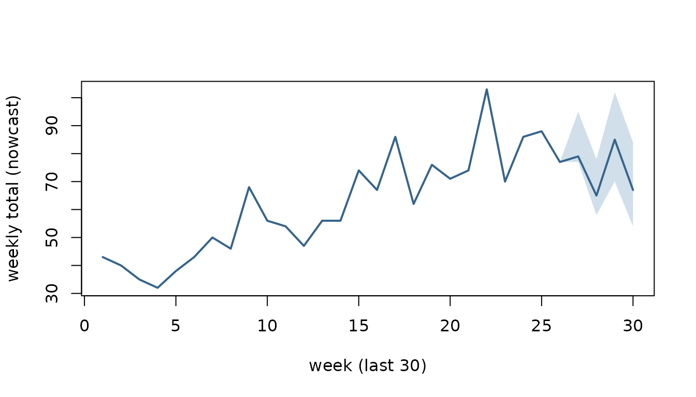

# Nowcasting a reporting triangle with csfmt_ensemble_v3

`csalert` provides a small, draw-parallel surveillance engine built
around three S3 formats:

- **`csfmt_reporting_triangle_v3`** — the reference-week ×
  reporting-week input (who was reported *when*).
- **`csfmt_ensemble_v3`** — `$data` plus, per measure, a matrix of
  Monte-Carlo `$draws` (rows = weeks, columns = simulations). Every
  analysis stage adds columns to the draws, so uncertainty propagates
  for free.
- a **quantile collapse** of those draws (optionally *healed* into
  [`cstidy::csfmt_rts_data_v3`](https://niphr.github.io/cstidy/reference/set_csfmt_rts_data_v3.html)
  for the usual plots/tables).

The analysis pipeline is: reporting triangle → nowcast → (rate /
short-term trend / MEM thresholds / signal detection) → collapse.
Alongside it sits a replay-based diagnostics harness — backtest →
**coverage** (are the intervals honest?), **revision** (how much will
today’s number still move?), and **reporting completion** (how fast does
the data actually arrive?). This vignette walks the whole path on
synthetic data.

``` r
library(data.table)
#> 
#> Attaching package: 'data.table'
#> The following object is masked from 'package:base':
#> 
#>     %notin%
library(csalert)
#> csalert 2026.7.1
#> https://niphr.github.io/csalert/
```

## A synthetic reporting triangle

Real surveillance data arrives with a delay: a case with reference week
`W` may only be *reported* in week `W`, `W+1`, `W+2`, … We simulate 70
weeks where most of a week’s cases are in within a week or two and a
tail dribbles in over a month.

``` r
weeks   <- cstime::dates_by_isoyearweek$isoyearweek
i0      <- match("2023-01", weeks)
max_delay  <- 5L
n_weeks    <- 70L
delay_prob <- c(0.45, 0.30, 0.15, 0.07, 0.03)     # P(delay = 0, 1, 2, 3, 4 weeks)

set.seed(1)
rows <- lapply(seq_len(n_weeks), function(w) {
  ref_i <- i0 + w - 1L
  n     <- rpois(1, 60 + 25 * sin(2 * pi * w / 52))   # a seasonal signal
  delay <- sample(0:(max_delay - 1L), n, replace = TRUE, prob = delay_prob)
  data.table(isoyearweek_reference = weeks[ref_i], rep_i = ref_i + delay)
})
ll <- rbindlist(rows)
ll[, isoyearweek_reporting := weeks[rep_i]]

# "today" is the last reference week: drop everything not reported yet, so the
# most recent weeks are still incomplete (right-truncated) -- exactly the problem
# a nowcast solves.
as_of_i <- i0 + n_weeks - 1L
ll <- ll[rep_i <= as_of_i]

triangle_long <- ll[, .(numerator = .N),
                    by = .(isoyearweek_reference, isoyearweek_reporting)]
triangle_long[, `:=`(indicator = "example", location = "nation",
                     age = "total", sex = "total")]
head(triangle_long)
#>    isoyearweek_reference isoyearweek_reporting numerator indicator location
#>                   <char>                <char>     <int>    <char>   <char>
#> 1:               2023-01               2023-04         4   example   nation
#> 2:               2023-01               2023-01        23   example   nation
#> 3:               2023-01               2023-03        10   example   nation
#> 4:               2023-01               2023-02        20   example   nation
#> 5:               2023-01               2023-05         1   example   nation
#> 6:               2023-02               2023-03        17   example   nation
#>       age    sex
#>    <char> <char>
#> 1:  total  total
#> 2:  total  total
#> 3:  total  total
#> 4:  total  total
#> 5:  total  total
#> 6:  total  total
```

Wrap it as a `csfmt_reporting_triangle_v3`. The `as_of` boundary (the
latest week we know about) is inferred from the newest reporting week.

``` r
tri <- csfmt_reporting_triangle_v3(
  triangle_long,
  id_cols       = c("indicator", "location", "age", "sex"),
  reference_col = "isoyearweek_reference",
  reporting_col = "isoyearweek_reporting",
  value_col     = "numerator"
)
attr(tri, "as_of")
#> [1] "2024-18"
```

## Nowcasting

[`nowcast_quasipoisson_v1()`](https://niphr.github.io/csalert/reference/nowcast_quasipoisson_v1.md)
regresses each settled week’s final total on the counts reported so far,
then simulates the incomplete recent weeks. It returns a
`csfmt_ensemble_v3`: one row per reference week and an `n_sim`-column
matrix of draws of the (completed) weekly total. Settled weeks are point
masses at their observed total; recent weeks carry the completion
uncertainty.

``` r
ens <- nowcast_quasipoisson_v1(tri, max_delay = max_delay, n_sim = 500)
ens
#> <csfmt_ensemble_v3> 70 rows | 1 series | draws: numerator_nowcasted
```

Collapse the draws to a quantile summary.

``` r
q <- ens_collapse(ens, probs = c(0.05, 0.5, 0.95))
tail(q[, .(isoyearweek,
           lo  = numerator_nowcasted_q05x0,
           med = numerator_nowcasted_q50x0,
           hi  = numerator_nowcasted_q95x0)], 8)
#>    isoyearweek    lo   med     hi
#>         <char> <num> <num>  <num>
#> 1:     2024-11 70.00    70  70.00
#> 2:     2024-12 86.00    86  86.00
#> 3:     2024-13 88.00    88  88.00
#> 4:     2024-14 77.00    77  77.00
#> 5:     2024-15 77.00    79  95.00
#> 6:     2024-16 58.00    65  78.00
#> 7:     2024-17 70.00    85 102.00
#> 8:     2024-18 53.95    67  84.05
```

The recent weeks have a widening interval (fewer reports in), the older
weeks are pinned to their settled total:

``` r
show <- tail(q, 30)
xs   <- seq_len(nrow(show))
plot(xs, show$numerator_nowcasted_q50x0, type = "n",
     ylim = range(show$numerator_nowcasted_q05x0, show$numerator_nowcasted_q95x0),
     xlab = "week (last 30)", ylab = "weekly total (nowcast)")
polygon(c(xs, rev(xs)),
        c(show$numerator_nowcasted_q05x0, rev(show$numerator_nowcasted_q95x0)),
        col = grDevices::adjustcolor("steelblue", 0.25), border = NA)
lines(xs, show$numerator_nowcasted_q50x0, lwd = 2, col = "steelblue4")
```



## Is the nowcast any good? A replay backtest

The reporting triangle records *when* every count arrived, so we can
reconstruct exactly what was known at any past week and replay the
method against it. A “method” is any function `f(triangle) -> ensemble`
with its parameters baked in;
[`nowcast_evaluate_v1()`](https://niphr.github.io/csalert/reference/nowcast_evaluate_v1.md)
replays it and scores the result into two scale-free diagnostics per
horizon (weeks-back from the as-of week; 0 = the current, least-observed
week):

- **coverage** — does the 90% / 50% interval actually contain the
  settled truth that often? (interval honesty; target 0.90 / 0.50)
- **revision** — how far the published median sits from where it
  eventually settles, as a fraction of the truth: signed (bias),
  absolute (typical move), a 5–95% band, and the tail probabilities.

``` r
method <- function(x) nowcast_quasipoisson_v1(x, max_delay = max_delay, n_sim = 500)
as_of_weeks <- utils::tail(weeks[i0:as_of_i], 30)     # replay the last 30 weeks
nowcast_evaluate_v1(tri, method, max_delay = max_delay,
                    as_of_weeks = as_of_weeks, horizons = 0:3, seed = 1)
#>    horizon     n coverage_50 coverage_90 median_signed median_abs     q05
#>      <int> <int>       <num>       <num>         <num>      <num>   <num>
#> 1:       3    29       1.000       1.000        0.0000     0.0213 -0.0503
#> 2:       2    28       0.857       1.000       -0.0100     0.0375 -0.1151
#> 3:       1    27       0.741       0.926        0.0132     0.0536 -0.1733
#> 4:       0    26       0.462       0.808       -0.0844     0.1328 -0.2617
#>       q95 p_gt_25 p_gt_50 method
#>     <num>   <num>   <num> <char>
#> 1: 0.0305  0.0000       0 method
#> 2: 0.0677  0.0000       0 method
#> 3: 0.1261  0.0370       0 method
#> 4: 0.3085  0.1923       0 method
```

Pass a *named list* of methods instead of one, and they are replayed on
the same paired draws (shared `seed`) and stacked with a `method`
column, so you can race several engines head-to-head.

## How fast does the data arrive? Reporting completion

[`reporting_completion()`](https://niphr.github.io/csalert/reference/reporting_completion.md)
reads the delay ECDF off the settled weeks: `pct_wN` is the pooled % of
a reference week’s cases reported once it has been observed for `N`
weeks. `period = "month"` / `"year"` slices it in time to expose drift.

``` r
reporting_completion(tri, max_delay = max_delay)
#>    indicator location    age    sex period n_settled mean_delay complete_by_md
#>       <char>   <char> <char> <char> <char>     <int>      <num>          <num>
#> 1:   example   nation  total  total    all        66       0.94              1
#>    pct_w1 pct_w2 pct_w3 pct_w4 pct_w5
#>     <num>  <num>  <num>  <num>  <num>
#> 1:   46.6   73.7   89.3   96.6    100
```

## The naming grammar

Every measure column is a self-describing name built and parsed by the
same grammar, so downstream code never hard-codes strings.

``` r
csfmt_var("numerator", role = "nowcasted", q = 0.5)   # -> the collapsed median column
#> [1] "numerator_nowcasted_q50x0"
csfmt_parse("numerator_nowcasted_q50x0")              # -> back to its components
#> $measure
#> [1] "numerator"
#> 
#> $role
#> [1] "nowcasted"
#> 
#> $q
#> [1] 0.5
```

## Where next

- Add a rate with
  [`ens_add_rate()`](https://niphr.github.io/csalert/reference/ens_add_rate.md)
  (numerator vs a nowcasted denominator), a short-term trend with
  [`short_term_trend()`](https://niphr.github.io/csalert/reference/short_term_trend.md),
  MEM intensity thresholds with
  [`mem_thresholds_v1()`](https://niphr.github.io/csalert/reference/mem_thresholds_v1.md),
  or exceedance detection with
  [`signal_detection_hlm()`](https://niphr.github.io/csalert/reference/signal_detection_hlm.md)
  — each just adds draw columns before the collapse.
- `ens_collapse(heal = TRUE)` returns a
  [`cstidy::csfmt_rts_data_v3`](https://niphr.github.io/cstidy/reference/set_csfmt_rts_data_v3.html)
  ready for the standard plotting/table helpers.
- Race candidate engines head-to-head by passing several methods to
  [`nowcast_evaluate_v1()`](https://niphr.github.io/csalert/reference/nowcast_evaluate_v1.md)
  and comparing their coverage / revision.
