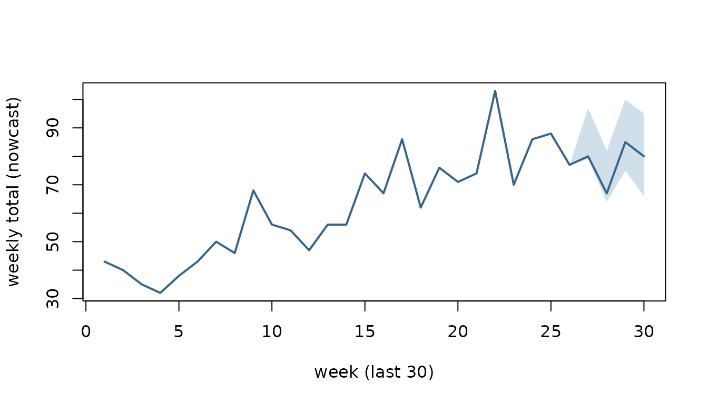

# Nowcasting a reporting triangle: an end-to-end pipeline

`csalert` provides a small, draw-parallel surveillance engine built
around three S3 formats:

- **`csfmt_reporting_triangle_v3`** — the reference-week x
  reporting-week input (who was reported *when*).
- **`csfmt_ensemble_v3`** — `$data` plus, per measure, a matrix of
  Monte-Carlo `$draws` (rows = weeks, columns = simulations). An
  analysis stage adds columns to the draws, so uncertainty propagates
  without a second pass.
- a **quantile collapse** of those draws (optionally *healed* into
  [`cstidy::csfmt_rts_data_v3`](https://niphr.github.io/cstidy/reference/set_csfmt_rts_data_v3.html)
  for the usual plots and tables).

This vignette runs one synthetic series through four stages:

1.  **Nowcast** — complete the right-truncated recent weeks.
2.  **Validation** — replay the method against what was known in the
    past and score it.
3.  **Reporting completion** — read the reporting delay off the triangle
    itself.
4.  **Short-term trend** — estimate the recent slope of the completed
    series, per draw.

One triangle carries all four, so the stages compose rather than each
opening a fresh demo dataset. When you set up a *new* indicator, run
stage 3 first: it is what supports the choice of `max_delay` that the
other three then use.

``` r
library(data.table)
#> 
#> Attaching package: 'data.table'
#> The following object is masked from 'package:base':
#> 
#>     %notin%
library(csalert)
#> csalert 2026.8.5
#> https://niphr.github.io/csalert/
```

## A synthetic reporting triangle

Real surveillance data arrives with a delay: a case with reference week
`W` may only be *reported* in week `W`, `W+1`, `W+2`, and so on. The
generator below simulates 70 reference weeks of a seasonal indicator,
with a **reporting speed-up built in at the start of ISO year 2024** —
the same system, reporting faster. Stage 3 recovers that change from the
triangle alone.

[`set.seed()`](https://rdrr.io/r/base/Random.html) is called *inside*
the generator, not beside it. A seed set outside a function that is
called more than once leaves the second call running on a different
stream, and the resulting Monte-Carlo noise reads as signal.

``` r
sim_reports <- function(first_ref = "2023-01",
                        n_weeks = 70L,
                        delay_slow = c(0.45, 0.30, 0.15, 0.07, 0.03),
                        delay_fast = c(0.70, 0.20, 0.06, 0.03, 0.01),
                        seed = 1L) {
  set.seed(seed)                                    # pinned inside, see above
  weeks <- cstime::dates_by_isoyearweek$isoyearweek
  i0 <- match(first_ref, weeks)
  rows <- lapply(seq_len(n_weeks), function(w) {
    ref <- weeks[i0 + w - 1L]
    p <- if (cstime::isoyearweek_to_isoyear_n(ref) <= 2023) delay_slow else delay_fast
    n <- rpois(1, 60 + 25 * sin(2 * pi * w / 52))   # a seasonal signal
    data.table(
      isoyearweek_reference = ref,
      isoyearweek_reporting = weeks[i0 + w - 1L + sample(0:4, n, TRUE, p)]
    )
  })
  # "today" is the last reference week: drop what has not been reported yet, so
  # the most recent weeks are still incomplete -- the problem a nowcast solves
  rbindlist(rows)[isoyearweek_reporting <= weeks[i0 + n_weeks - 1L]]
}

reports <- sim_reports()
triangle_long <- reports[, .(numerator = .N),
                         by = .(isoyearweek_reference, isoyearweek_reporting)]
triangle_long[, `:=`(indicator = "example", location = "nation",
                     age = "total", sex = "total")]
head(triangle_long, 4)
#>    isoyearweek_reference isoyearweek_reporting numerator indicator location
#>                   <char>                <char>     <int>    <char>   <char>
#> 1:               2023-01               2023-04         4   example   nation
#> 2:               2023-01               2023-01        23   example   nation
#> 3:               2023-01               2023-03        10   example   nation
#> 4:               2023-01               2023-02        20   example   nation
#>       age    sex
#>    <char> <char>
#> 1:  total  total
#> 2:  total  total
#> 3:  total  total
#> 4:  total  total
```

Wrap it as a `csfmt_reporting_triangle_v3`. The as-of boundary is read
from the data — it is the newest reporting week present, not the system
clock.

``` r
tri <- csfmt_reporting_triangle_v3(
  triangle_long,
  id_cols       = c("indicator", "location", "age", "sex"),
  reference_col = "isoyearweek_reference",
  reporting_col = "isoyearweek_reporting",
  value_col     = "numerator"
)
c(as_of = attr(tri, "as_of"),
  newest_reporting_week = max(triangle_long$isoyearweek_reporting))
#>                 as_of newest_reporting_week 
#>             "2024-18"             "2024-18"
```

`max_delay` is the delay horizon used by stages 1 to 3 below. Stage 3
shows how to choose it from the data; 5 weeks is the right answer for
this series.

``` r
max_delay <- 5L
```

## 1. Nowcast

**Estimand.** For each reference week, the total that will have been
reported at delays `0 .. max_delay - 1` — that is, by the end of ISO
week `reference_week + max_delay - 1`. This is a horizon-capped total,
**not** the eventual total: anything reported later than `max_delay - 1`
weeks is outside the estimand and no amount of nowcasting recovers it.
Stage 3 is how you check that the horizon is wide enough for the
difference to be small. For a settled week the quantity is already
observed; for the most recent weeks it is not, and the nowcast is a
predictive distribution over it.

[`nowcast_quasipoisson_v1()`](https://niphr.github.io/csalert/reference/nowcast_quasipoisson_v1.md)
is a discriminative (regression) engine. For each number of weeks a
reference week has been observed it fits, on the settled weeks, a
quasipoisson regression with an identity link of the settled total on
the counts reported so far:

    total ~ n[delay 0] + n[delay 1] + ... + n[delay h]

R’s default intercept is present in that formula and is fitted. There is
no per-week magnitude parameter, so the recent weeks do not each carry
their own noisy level. Draws combine the fit’s parameter uncertainty
with a dispersion-matched negative binomial. `delay_window` (default 26
weeks) restricts training to the settled weeks within roughly that span,
so the partial-to-total mapping can follow a reporting regime that
changes — as this series’ does.

``` r
set.seed(2)
ens <- nowcast_quasipoisson_v1(tri, max_delay = max_delay, n_sim = 500)
ens
#> <csfmt_ensemble_v3> 70 rows | 1 series | draws: numerator_nowcasted
```

Collapse the draws to a quantile summary. `original` is the count
reported so far; the settled weeks sit exactly on it, the recent weeks
are completed above it.

``` r
q <- ens_collapse(ens, probs = c(0.05, 0.5, 0.95))
tail(q[, .(isoyearweek, original,
           lo  = numerator_nowcasted_q05x0,
           med = numerator_nowcasted_q50x0,
           hi  = numerator_nowcasted_q95x0)], 8)
#>    isoyearweek original    lo   med    hi
#>         <char>    <num> <num> <num> <num>
#> 1:     2024-11       70 70.00    70    70
#> 2:     2024-12       86 86.00    86    86
#> 3:     2024-13       88 88.00    88    88
#> 4:     2024-14       77 77.00    77    77
#> 5:     2024-15       79 79.00    80    97
#> 6:     2024-16       64 64.00    67    82
#> 7:     2024-17       75 75.00    85   100
#> 8:     2024-18       55 65.95    80    95
```

The settled weeks are pinned to their observed total, so they have no
band at all. Only the incomplete weeks at the right-hand edge carry one:

``` r
show <- tail(q, 30)
xs   <- seq_len(nrow(show))
plot(xs, show$numerator_nowcasted_q50x0, type = "n",
     ylim = range(show$numerator_nowcasted_q05x0, show$numerator_nowcasted_q95x0),
     xlab = "week (last 30)", ylab = "weekly total (nowcast)")
polygon(c(xs, rev(xs)),
        c(show$numerator_nowcasted_q05x0, rev(show$numerator_nowcasted_q95x0)),
        col = grDevices::adjustcolor("steelblue", 0.25), border = NA)
lines(xs, show$numerator_nowcasted_q50x0, lwd = 2, col = "steelblue4")
```



Keep the reference weeks: the later stages index off them.

``` r
weeks     <- cstime::dates_by_isoyearweek$isoyearweek
ref_weeks <- q$isoyearweek
```

## 2. Validation: replay the method against the past

Because the triangle records *when* every count arrived, you can
reconstruct what was known at any past week and replay the engine
against it, without keeping a second dated extract.

That reconstruction is exact only for an **append-only** reporting
system: one where a count, once filed, keeps its original reporting week
forever. Real systems also issue retrospective corrections, delete
records and reclassify cases, and none of those leave a trace in the
current triangle — a case reclassified last month looks as though it was
always classified that way. Where such revisions matter, replay
understates how much the published numbers actually moved, and a dated
archive of extracts is the only way to measure it.

[`nowcast_censor()`](https://niphr.github.io/csalert/reference/nowcast_censor.md)
does the rewind. It returns a `csfmt_reporting_triangle_v3` with every
cell reported after the given week dropped, and its as-of boundary moved
back:

``` r
past <- nowcast_censor(tri, as_of = ref_weeks[length(ref_weeks) - 8L])
c(now  = attr(tri, "as_of"),  then      = attr(past, "as_of"),
  rows_now = nrow(tri),       rows_then = nrow(past))
#>       now      then  rows_now rows_then 
#> "2024-18" "2024-10"     "324"     "285"
```

[`nowcast_truth()`](https://niphr.github.io/csalert/reference/nowcast_truth.md)
supplies the target. It returns a two-column data.table (`reference`,
`truth`) of each reference week’s total summed over delays
`0 .. max_delay - 1`, keeping only the weeks old enough for that total
to be settled. The newest weeks are absent by design: they have no truth
to be scored against yet.

``` r
truth <- nowcast_truth(tri, max_delay = max_delay)
tail(truth, 3)
#>    reference truth
#>       <char> <num>
#> 1:   2024-12    86
#> 2:   2024-13    88
#> 3:   2024-14    77
c(reference_weeks = length(ref_weeks), settled = nrow(truth))
#> reference_weeks         settled 
#>              70              66
```

A *method* is any function `f(triangle) -> csfmt_ensemble_v3` with its
own parameters baked in. That one-argument contract is what lets engines
with different signatures be replayed and compared through the same
harness.

``` r
method_qp <- function(x) nowcast_quasipoisson_v1(x, max_delay = max_delay, n_sim = 500)
as_of_weeks <- tail(ref_weeks, 30)
```

[`nowcast_backtest()`](https://niphr.github.io/csalert/reference/nowcast_backtest.md)
runs the replay and returns the raw scored quantiles: one long row per
`reference` x `as_of` x `horizon` x `quantile_level`, with the predicted
value. `horizon` is weeks between the reference week and the as-of week,
so horizon 0 is the current, least-observed week.

``` r
bt <- nowcast_backtest(
  tri, method_qp,
  max_delay   = max_delay,
  as_of_weeks = as_of_weeks,
  horizons    = 0:3,
  probs       = c(0.05, 0.25, 0.5, 0.75, 0.95),
  seed        = 1
)
head(bt, 4)
#>    reference   as_of horizon quantile_level predicted
#>       <char>  <char>   <int>          <num>     <num>
#> 1:   2023-38 2023-41       3           0.05        33
#> 2:   2023-39 2023-41       2           0.05        24
#> 3:   2023-40 2023-41       1           0.05        36
#> 4:   2023-41 2023-41       0           0.05        45
nrow(bt)
#> [1] 600
```

[`nowcast_evaluate_v1()`](https://niphr.github.io/csalert/reference/nowcast_evaluate_v1.md)
wraps that replay and scores it, joining each forecast to its settled
truth. It returns one row per group (default: per horizon) per method:

- `n` — the number of scored forecasts behind that row.
- `coverage_50`, `coverage_90` — the **measured share of settled truths
  that fell inside the nominal 50% and 90% central intervals** on this
  replay. These are sample quantities, not a property of the
  construction.
- `median_signed`, `median_abs`, `q05`, `q95`, `p_gt_25`, `p_gt_50` —
  the revision of the published median relative to the settled truth, as
  a fraction of the truth. `median_signed` is the **median signed
  relative revision** across the replayed forecasts, not a mean, so it
  is not the bias in the usual expected-error sense. `p_gt_25` and
  `p_gt_50` are **empirical exceedance proportions** — the share of
  replayed forecasts whose absolute relative revision exceeded 0.25 and
  0.50 — not probabilities of anything.

Passing a **named list** of methods replays every method over the same
reference and as-of weeks, so the comparison is paired **by forecast
unit**. `seed` makes each method’s own run reproducible; it does not by
itself create common random numbers across methods, which would need the
algorithms to consume compatible variates. Here it cannot:
[`nowcast_passthrough_to_ensemble_v1()`](https://niphr.github.io/csalert/reference/nowcast_passthrough_to_ensemble_v1.md)
draws no random numbers at all. Racing against it — it does no
completion and just republishes the counts reported so far — makes the
numbers readable:

``` r
ev <- nowcast_evaluate_v1(
  tri,
  methods = list(
    quasipoisson = method_qp,
    passthrough  = function(x) nowcast_passthrough_to_ensemble_v1(x, max_delay = max_delay)
  ),
  max_delay   = max_delay,
  as_of_weeks = as_of_weeks,
  horizons    = 0:3,
  seed        = 1
)
ev[, .(method, horizon, n, coverage_50, coverage_90, median_signed, median_abs)]
#>          method horizon     n coverage_50 coverage_90 median_signed median_abs
#>          <char>   <int> <int>       <num>       <num>         <num>      <num>
#> 1: quasipoisson       3    29       1.000       1.000        0.0000     0.0141
#> 2: quasipoisson       2    28       0.964       1.000        0.0000     0.0343
#> 3: quasipoisson       1    27       0.778       1.000        0.0141     0.0455
#> 4: quasipoisson       0    26       0.654       0.885        0.0182     0.0893
#> 5:  passthrough       3    29       0.276       0.276       -0.0185     0.0185
#> 6:  passthrough       2    28       0.000       0.000       -0.0652     0.0652
#> 7:  passthrough       1    27       0.000       0.000       -0.1774     0.1774
#> 8:  passthrough       0    26       0.000       0.000       -0.3859     0.3859
```

Read that table as a measurement on **this** sample and no further. Each
row rests on 26 to 29 scored weeks of one synthetic series, which is far
too few to characterise either engine: a coverage estimate from 26
scored weeks has a standard error of roughly 0.06 at 0.9 and 0.10 at
0.5, before any dependence between overlapping windows is allowed for.

What the comparison does show is the *shape* of the problem. What
construction guarantees for the passthrough is only this: each of its
forecasts is **no greater** than the settled truth, because a count that
is still arriving cannot exceed its own total. Every individual revision
is therefore zero or negative. That alone does not force a strictly
negative *median* at a given horizon — if more than half the weeks were
already complete, the median would be exactly zero — and it does not
order the horizons. The negative `median_signed` at all four horizons,
and horizon 0 being the worst, are findings on this sample, not
consequences of the construction.

Its `coverage_50` and `coverage_90` are equal because a single draw
gives it no interval at all — the “interval” is a point, so it covers
the truth only when the republished count already equals it, which at
horizon 3 happens on the weeks where nothing arrived at delay 4.

[`nowcast_estimate_calibration_v1()`](https://niphr.github.io/csalert/reference/nowcast_estimate_calibration_v1.md)
reports the same per-horizon coverage alongside an interval-scaling
factor learned from the replay. Its documentation is explicit that this
is an empirical rescaling and not split conformal, so the factor carries
no finite-sample coverage guarantee.

## 3. Reporting completion: how fast does the data actually arrive?

### What `pct_delayD` counts

**`pct_delay0` is the share of a reference week’s cases that were
reported during that same ISO week.** Delay 0 is the reference week
itself, not the week after it. In general:

> `pct_delayD` is the pooled share of a reference week’s cases reported
> by the end of ISO week `reference_week + D`.

The columns are indexed by **delay**, 0-based, so the index in the name
is the delay it reports. There are `max_delay` of them and the highest
is `pct_delay<max_delay - 1>`, matching the triangle’s own delay axis.
Each is the delay ECDF read at one delay, with no interpolation.
`mean_delay` is on the same axis and in whole weeks, so a week whose
cases all arrive at delay 0 has `mean_delay` 0, not 1.

A triangle with a known answer settles it. Below, each reference week
generates exactly 50 at delay 0, 30 at delay 1 and 20 at delay 2,
right-truncated at the newest reporting week the way real data is:

``` r
i <- match("2023-01", weeks)
pin <- data.table(
  isoyearweek_reference = weeks[i + rep(0:29, each = 3)],
  isoyearweek_reporting = weeks[i + rep(0:29, each = 3) + rep(0:2, 30)],
  numerator = rep(c(50, 30, 20), 30),
  indicator = "pinned", location = "nation", age = "total", sex = "total"
)
pin <- pin[isoyearweek_reporting <= weeks[i + 29]]
tri_pin <- csfmt_reporting_triangle_v3(
  pin, id_cols = c("indicator", "location", "age", "sex")
)
reporting_completion_v1(tri_pin, max_delay = 3)[
  , .(n_settled, mean_delay, complete_by_md, pct_delay0, pct_delay1, pct_delay2)]
#>    n_settled mean_delay complete_by_md pct_delay0 pct_delay1 pct_delay2
#>        <int>      <num>          <num>      <num>      <num>      <num>
#> 1:        28        0.7              1         50         80        100
```

`pct_delay0` is 50, not 80: it is the delay-0 share, the reports that
arrived in the reference week itself. `pct_delay1` is 80 — cumulative
through delay 1. `mean_delay` is `0*0.50 + 1*0.30 + 2*0.20 = 0.70`.

**Coming from an older script?** These columns used to be named
`pct_w1`, `pct_w2`, …, counting weeks-observed from 1, so no number in a
column name ever equalled the delay it stood for. Your `pct_w1` is now
`pct_delay0`, `pct_w2` is `pct_delay1`, and so on. The old names are
gone rather than redefined, so old code errors on a missing column
instead of quietly returning a different week.

`n_settled` is 28, not 30. Age eligibility is the first filter: a
reference week is eligible once
`as_of_week - reference_week >= max_delay - 1`, which excludes the two
most recent of those 30. A second filter then drops any eligible week
whose total within the horizon is zero, and `n_settled` counts what
survives both. Here no week is empty, so the age rule alone accounts for
the number — and the same holds on the working triangle:

``` r
age <- match(attr(tri, "as_of"), weeks) - match(ref_weeks, weeks)
completion <- reporting_completion_v1(tri, max_delay = max_delay)
c(age_eligible = sum(age >= max_delay - 1L), reported = completion$n_settled)
#> age_eligible     reported 
#>           66           66
```

They agree only because this series has no zero-count weeks. On an
indicator with quiet weeks — a rare pathogen, a small stratum —
`n_settled` will be the smaller of the two, and a period slice with
fewer than three surviving weeks is dropped from the output entirely.

### A worked reference week

Take reference week **2023-07**. `cstime` gives its calendar dates, and
the two weeks after it:

``` r
cstime::dates_by_isoyearweek[
  isoyearweek %in% c("2023-07", "2023-08", "2023-09"),
  .(isoyearweek, isoyear, mon, thu, sun)
]
#>    isoyearweek isoyear        mon        thu        sun
#>         <char>   <int>     <Date>     <Date>     <Date>
#> 1:     2023-07    2023 2023-02-13 2023-02-16 2023-02-19
#> 2:     2023-08    2023 2023-02-20 2023-02-23 2023-02-26
#> 3:     2023-09    2023 2023-02-27 2023-03-02 2023-03-05
```

For a case whose reference week is 2023-07:

| statistic    | covers reports up to    | which is          |
|--------------|-------------------------|-------------------|
| `pct_delay0` | end of ISO week 2023-07 | Sunday 2023-02-19 |
| `pct_delay1` | end of ISO week 2023-08 | Sunday 2023-02-26 |
| `pct_delay2` | end of ISO week 2023-09 | Sunday 2023-03-05 |

So `pct_delay0` is a statement about the seven days from Monday
2023-02-13, and `pct_delay1` about the **14** days from that same Monday
— not the seven days of week 2023-08 on their own. The columns are
cumulative.

### Which day of the week you run it on

**The day of the week does not change the delay arithmetic at all.**
Delay is computed from the two ISO-week labels only, so every day of a
week carries the same label and lands in the same delay bucket:

``` r
days <- seq(as.Date("2023-02-13"), as.Date("2023-02-19"), by = "day")
data.table(date = days, weekday = weekdays(days),
           isoyearweek = cstime::date_to_isoyearweek_c(days))
#>          date   weekday isoyearweek
#>        <Date>    <char>      <char>
#> 1: 2023-02-13    Monday     2023-07
#> 2: 2023-02-14   Tuesday     2023-07
#> 3: 2023-02-15 Wednesday     2023-07
#> 4: 2023-02-16  Thursday     2023-07
#> 5: 2023-02-17    Friday     2023-07
#> 6: 2023-02-18  Saturday     2023-07
#> 7: 2023-02-19    Sunday     2023-07
```

Both runs put a report filed that week at delay 0 for reference week
2023-07, at delay 1 for 2023-06, and so on. Nothing in the pipeline
reads the system clock: the as-of boundary comes from the newest
reporting week *present in the data*.

That last phrase carries a condition worth stating. `as_of` is
`max(reporting_week)`, so a Monday and a Friday run see the same
`as_of = "2023-07"` **only if the Monday extract already contains at
least one report filed in week 2023-07**. If it contains none — a
plausible Monday morning on a slow indicator — `as_of` silently falls
back to `"2023-06"`, every week’s age shifts by one, and one more
reference week is treated as settled. That is a different analysis, not
a smaller one, and nothing in the output announces it.

What the day *does* change is **how much of the current week’s reporting
has landed**. On Monday almost none of it has; in this illustration all
of it is in by Sunday, which assumes the extract is taken after the week
closes and that the system files everything within the week it belongs
to. Neither is guaranteed in general. In a Monday extract every cell
whose reporting week is the current week is still filling — the delay-0
cell of the current reference week most visibly, but also the delay-1
cell of last week, the delay-2 cell of the week before, and so on.

That matters for the completion table in one narrow place, and it is
worth being precise about which. Thin the current week’s reports down to
15%, as a Monday extract would see them, and rebuild:

``` r
set.seed(5)
monday <- reports[isoyearweek_reporting != attr(tri, "as_of") | runif(.N) < 0.15]
tl_mon <- monday[, .(numerator = .N),
                 by = .(isoyearweek_reference, isoyearweek_reporting)]
tl_mon[, `:=`(indicator = "example", location = "nation",
              age = "total", sex = "total")]
tri_mon <- csfmt_reporting_triangle_v3(
  tl_mon, id_cols = c("indicator", "location", "age", "sex")
)

rbind(
  cbind(extract = "Sunday (week complete)",
        reporting_completion_v1(tri, max_delay = max_delay)[
          , .(n_settled, mean_delay, pct_delay0, pct_delay1, pct_delay2, pct_delay3)]),
  cbind(extract = "Monday (15% of the week in)",
        reporting_completion_v1(tri_mon, max_delay = max_delay)[
          , .(n_settled, mean_delay, pct_delay0, pct_delay1, pct_delay2, pct_delay3)])
)
#>                        extract n_settled mean_delay pct_delay0 pct_delay1
#>                         <char>     <int>      <num>      <num>      <num>
#> 1:      Sunday (week complete)        66       0.82       52.1       77.9
#> 2: Monday (15% of the week in)        66       0.82       52.2       77.9
#>    pct_delay2 pct_delay3
#>         <num>      <num>
#> 1:       90.9       97.4
#> 2:       90.9       97.4
```

The pooled curve barely moves, and `n_settled` is identical, because the
current reference week is never in the settled set. For any `max_delay`
of 2 or more its age is 0, which is below the `max_delay - 1` threshold,
so it contributes nothing to `pct_delayD` whichever day you run on. (A
`max_delay` of 1 leaves a single delay bucket, no completion to measure,
and no useful summary; use 2 or more.)

One reference week *is* affected, and it is the newest settled one. Its
last delay cell — delay `max_delay - 1` — is being reported during the
current week, so a mid-week extract sees only part of it. Count the
weeks whose settled total moved, rather than assuming it is one:

``` r
cmp <- merge(nowcast_truth(tri, max_delay), nowcast_truth(tri_mon, max_delay),
             by = "reference", suffixes = c("_sunday", "_monday"))
cmp[(.N - 2):.N]
#> Key: <reference>
#>    reference truth_sunday truth_monday
#>       <char>        <num>        <num>
#> 1:   2024-12           86           86
#> 2:   2024-13           88           88
#> 3:   2024-14           77           76
cmp[truth_sunday != truth_monday]
#> Key: <reference>
#>    reference truth_sunday truth_monday
#>       <char>        <num>        <num>
#> 1:   2024-14           77           76
```

So: **on this triangle** the day of the week moves the pooled delay
curve by about a tenth of a percentage point. That is not a general
result. One settled week’s cell is being diluted into a pool of 66, and
the effect scales with how much weight that single week carries — with
three qualifying weeks, or with one recent week far larger than the
rest, the same mechanism is material. Measure it on your own series
before deciding it is negligible.

The newest settled week’s *total* is a different matter, and there a
mid-week extract genuinely undercounts. That total is what
[`nowcast_truth()`](https://niphr.github.io/csalert/reference/nowcast_truth.md)
scores a backtest against, so run the backtest off an end-of-week
extract, or accept that the newest scored week enters low.

### “As of today”, for the weeks on screen

With `as_of` = 2024-18 and `max_delay` = 5, the reference weeks split
three ways:

``` r
data.table(
  isoyearweek = ref_weeks,
  weeks_observed = age + 1L,
  status = fifelse(age >= max_delay - 1L, "settled",
           fifelse(age > 0L, "still filling", "current week"))
)[, .N, keyby = status]
#> Key: <status>
#>           status     N
#>           <char> <int>
#> 1:  current week     1
#> 2:       settled    66
#> 3: still filling     3
```

Four weeks are not settled: three still filling, plus the current week,
which has only its delay-0 reports. Those are the weeks the nowcast in
stage 1 completed, and the weeks the completion table declines to learn
from. The completed weeks are the ones whose nowcast rises above the
count reported so far:

``` r
q[numerator_nowcasted_q95x0 > original, isoyearweek]
#> [1] "2024-15" "2024-16" "2024-17" "2024-18"
```

### Reporting drift: `period = "year"`

`period = "year"` returns **one row per qualifying ISO year**, and it is
how you see a reporting system speeding up or slowing down. One pooled
curve cannot: it averages the regimes together and describes neither.

“Qualifying” is load-bearing. A period slice needs at least three
settled weeks with a non-zero within-horizon total, or it is dropped
from the result with no warning and no placeholder row. A year at the
edge of the series — the one your data starts or ends in — is the usual
casualty, so a missing year means too few weeks, never zero delay.

``` r
reporting_completion_v1(tri, max_delay = max_delay, period = "year")[
  , .(period, n_settled, mean_delay, pct_delay0, pct_delay1, pct_delay2, pct_delay3)]
#>    period n_settled mean_delay pct_delay0 pct_delay1 pct_delay2 pct_delay3
#>    <char>     <int>      <num>      <num>      <num>      <num>      <num>
#> 1:   2023        52       0.93       46.7       74.2       89.5       96.9
#> 2:   2024        14       0.49       68.0       88.7       95.1       98.8
```

That is the change built into `sim_reports()`, recovered from the
triangle: in 2023 about 47% of a week’s cases were in by the end of the
reference week, in 2024 about 68%, and `mean_delay` roughly halved. The
pooled row above reports `pct_delay0` around 52 — a number that was
never true of either year.

The stratification is by **ISO year**, not calendar year, and the ISO
year of a week is the calendar year of its Thursday. That decides which
year owns a boundary week:

``` r
cstime::dates_by_isoyearweek[
  isoyearweek %in% c("2022-52", "2023-01"), .(isoyearweek, isoyear, mon, thu, sun)
]
#>    isoyearweek isoyear        mon        thu        sun
#>         <char>   <int>     <Date>     <Date>     <Date>
#> 1:     2022-52    2022 2022-12-26 2022-12-29 2023-01-01
#> 2:     2023-01    2023 2023-01-02 2023-01-05 2023-01-08
```

ISO week 2022-52 has its Thursday on 2022-12-29, so it belongs to ISO
year 2022 even though its Sunday, 2023-01-01, is a calendar-2023 date.
ISO week 2023-01 has its Thursday on 2023-01-05 and belongs to 2023.

`period = "month"` slices finer and localises *when* a change happened.
It uses the same Thursday rule to decide which calendar month owns a
week that straddles two:

``` r
tail(reporting_completion_v1(tri, max_delay = max_delay, period = "month")[
  , .(period, n_settled, mean_delay, pct_delay0, pct_delay1)], 6)
#>     period n_settled mean_delay pct_delay0 pct_delay1
#>     <char>     <int>      <num>      <num>      <num>
#> 1: 2023-10         4       0.77       51.6       80.0
#> 2: 2023-11         5       0.95       45.0       75.6
#> 3: 2023-12         4       0.96       44.9       72.4
#> 4: 2024-01         4       0.52       66.8       87.4
#> 5: 2024-02         5       0.51       65.3       89.2
#> 6: 2024-03         4       0.45       72.0       89.3
```

The step lands between 2023-12 and 2024-01. Note the small `n_settled`
per month — four or five weeks — so a single month’s row is noisy; read
the sequence, not one row.

### Every number here is conditional on `max_delay`

This is the trap, and it is structural rather than a tuning subtlety.
[`reporting_completion_v1()`](https://niphr.github.io/csalert/reference/reporting_completion_v1.md)
works from a triangle that has already had every cell with delay
`>= max_delay` discarded. So the denominator is the total that arrived
*within the horizon*, not the eventual total. Two consequences follow,
and they hold whatever the real reporting tail looks like:

- `complete_by_md` is the last cumulative fraction of that same
  truncated total, so it is 1.
- the last column, `pct_delay<max_delay - 1>`, is that fraction as a
  percentage, so it is 100.

Neither can detect reporting that dribbles in past the horizon. Rather
than assert that, check it — here across `max_delay` 2 through 8 on this
triangle, reading the last column by name each time:

``` r
sens <- rbindlist(lapply(2:8, function(md) {
  r <- reporting_completion_v1(tri, max_delay = md)
  data.table(max_delay = md, n_settled = r$n_settled, mean_delay = r$mean_delay,
             complete_by_md = r$complete_by_md,
             last_col = paste0("pct_delay", md - 1L),
             last_pct = r[[paste0("pct_delay", md - 1L)]],
             pct_delay0 = r$pct_delay0, pct_delay1 = r$pct_delay1,
             pct_delay2 = r$pct_delay2)
}), fill = TRUE)
sens
#>    max_delay n_settled mean_delay complete_by_md   last_col last_pct pct_delay0
#>        <int>     <int>      <num>          <num>     <char>    <num>      <num>
#> 1:         2        69       0.32              1 pct_delay1      100       67.5
#> 2:         3        68       0.56              1 pct_delay2      100       57.9
#> 3:         4        67       0.72              1 pct_delay3      100       53.9
#> 4:         5        66       0.82              1 pct_delay4      100       52.1
#> 5:         6        65       0.82              1 pct_delay5      100       51.9
#> 6:         7        64       0.83              1 pct_delay6      100       51.4
#> 7:         8        63       0.84              1 pct_delay7      100       51.0
#>    pct_delay1 pct_delay2
#>         <num>      <num>
#> 1:      100.0         NA
#> 2:       85.9      100.0
#> 3:       80.2       93.4
#> 4:       77.9       90.9
#> 5:       77.7       90.8
#> 6:       77.5       90.8
#> 7:       77.3       90.7
c(complete_by_md_always_1 = all(sens$complete_by_md == 1),
  last_pct_always_100     = all(sens$last_pct == 100))
#> complete_by_md_always_1     last_pct_always_100 
#>                    TRUE                    TRUE
```

The same holds inside every period slice, which is where it is easiest
to mistake for a finding:

``` r
per <- rbindlist(lapply(c("all", "year", "month"), function(p) {
  r <- reporting_completion_v1(tri, max_delay = max_delay, period = p)
  data.table(period_arg = p, rows = nrow(r),
             complete_by_md_all_1 = all(r$complete_by_md == 1),
             pct_delay4_all_100 = all(r$pct_delay4 == 100))
}))
per
#>    period_arg  rows complete_by_md_all_1 pct_delay4_all_100
#>        <char> <int>               <lgcl>             <lgcl>
#> 1:        all     1                 TRUE               TRUE
#> 2:       year     2                 TRUE               TRUE
#> 3:      month    15                 TRUE               TRUE
```

**The diagnostic that does work is the `max_delay` sweep itself.** Read
the `sens` table above down its rows: `mean_delay` rises from 0.32 at
`max_delay` 2 to 0.82 at 5, then moves only to 0.84 at 8. `pct_delay0`
falls from 67.5 to 52.1 and then drifts to 51.0. That flattening is what
*supports* `max_delay <- 5L` here — it is a sensitivity analysis, not a
proof. A `mean_delay` that kept climbing would be clear evidence the
tail was still being cut off; a plateau is weaker evidence in the other
direction, because a genuinely sparse tail and a shifting settled-week
composition both flatten the curve too.

Two cautions on reading that sweep:

- The short horizons are not merely imprecise, they are biased
  optimistic. `pct_delay0` at `max_delay` 2 reads 67.5% because it is
  conditioning on the cases that arrived within two weeks — a smaller
  denominator, so a larger share.
- Not all of the residual movement past 5 is about the tail. `n_settled`
  falls from 66 to 63 across those rows, because a longer horizon
  settles fewer weeks. This series reports faster in 2024, so dropping
  its three newest weeks lowers the pooled `pct_delay0` on composition
  alone. Compare rows at equal `n_settled`, or read `period = "year"`
  instead, before calling a small drift a tail.

`sim_reports()` emits no delay beyond 4, so on *this* triangle a horizon
of 5 truncates nothing and the flattening really is exact — but only
because we can read the generator. On a real series that check is
unavailable: widen until `mean_delay` stops moving, then treat the
remaining tail as bounded by what a still-wider horizon would have
shown, not as zero.

## 4. Short-term trend on the nowcast

**Estimand.** The OLS slope of the *completed* series over the last
`trend_isoyearweeks` weeks, and that slope as a percentage of the
current level. This is a **descriptive** quantity: a summary of the six
numbers in the window, not an estimate of a latent growth parameter.
Read per draw, it inherits exactly the uncertainty the nowcast put into
those six numbers, and no other.

Running the trend on the nowcast rather than on the reported counts is
the point of the pipeline: the reported counts turn down at the
right-hand edge simply because the reports have not arrived, and a trend
fitted to them reports a fall that is an artefact of reporting.

The method returns a slope, a growth rate and the fraction of draws
whose slope is positive. It does **not** return an increasing /
not-increasing classification; if you want one, you choose the cut-off
on that fraction yourself. (The
[`cstidy::csfmt_rts_data_v1`](https://niphr.github.io/cstidy/reference/set_csfmt_rts_data_v1.html)
method of
[`short_term_trend()`](https://niphr.github.io/csalert/reference/short_term_trend.md)
does return a status factor — a different estimator, discussed at the
end of this section.)

The ensemble method fits, independently down every draw column, a
closed-form OLS straight line through that draw’s last
`trend_isoyearweeks` nowcasted counts. It adds two draw matrices and one
point column:

``` r
ens_trend <- short_term_trend(ens, measure = "numerator_nowcasted",
                              trend_isoyearweeks = 6)
names(ens_trend$draws)
#> [1] "numerator_nowcasted"             "numerator_nowcasted_trend_beta1"
#> [3] "numerator_nowcasted_trend_gr"
setdiff(names(ens_trend$data), names(ens$data))
#> [1] "numerator_nowcasted_trend_increasing_pr"
```

- `..._trend_beta1` — the OLS slope, in counts per week, per draw.
- `..._trend_gr` — the growth rate `100 * slope / level`, per draw, in
  percent of the current level per week.
- `..._trend_increasing_pr` — the share of draws with a positive slope.
  It is already a reduction over the draw axis, so it lives on `$data`
  and is not collapsed.

Collapse as usual:

``` r
qt <- ens_collapse(ens_trend, probs = c(0.05, 0.5, 0.95))
trend <- qt[, .(isoyearweek,
                gr    = round(numerator_nowcasted_trend_gr_q50x0, 2),
                gr_lo = round(numerator_nowcasted_trend_gr_q05x0, 2),
                gr_hi = round(numerator_nowcasted_trend_gr_q95x0, 2),
                p_increasing = numerator_nowcasted_trend_increasing_pr)]
tail(trend, 10)
#>     isoyearweek    gr gr_lo gr_hi p_increasing
#>          <char> <num> <num> <num>        <num>
#>  1:     2024-09  0.15  0.15  0.15        1.000
#>  2:     2024-10  3.22  3.22  3.22        1.000
#>  3:     2024-11  5.06  5.06  5.06        1.000
#>  4:     2024-12  2.52  2.52  2.52        1.000
#>  5:     2024-13  2.86  2.86  2.86        1.000
#>  6:     2024-14 -0.52 -0.52 -0.52        0.000
#>  7:     2024-15 -3.29 -3.51 -0.21        0.036
#>  8:     2024-16 -1.29 -2.77  1.52        0.226
#>  9:     2024-17 -1.87 -4.61  0.70        0.124
#> 10:     2024-18 -1.12 -4.75  1.79        0.272
```

The last four rows are the nowcast weeks. Their point estimates are
negative — the seasonal wave in this series is past its peak — but the
5-95% bands cross zero, so on this series and this window the recent
direction is not resolved. That is the honest reading of a trend fitted
to weeks that are still filling.

### The settled weeks have no interval, and that is the right answer

Look at the rows above the nowcast weeks: `gr_lo` and `gr_hi` equal
`gr`, and `p_increasing` is exactly 0 or 1. That is not a display
artefact and it is not a defect. Those windows lie entirely inside the
settled weeks, where every draw is the same observed total. The six
counts are *known*, so their OLS slope is a known number, and the
descriptive estimand has nothing left to be uncertain about.
`p_increasing` collapses to a **sign indicator** on that one number —
which is what a share-of-draws becomes when all the draws agree. It is
not a sign test, and no inference is being performed. Measured rather
than asserted:

``` r
settled_weeks <- truth$reference
tr_settled <- trend[isoyearweek %in% settled_weeks & !is.na(gr_lo)]
data.table(
  settled_rows_with_a_full_window = nrow(tr_settled),
  all_intervals_degenerate = all(tr_settled$gr_lo == tr_settled$gr_hi),
  p_increasing_values = paste(sort(unique(tr_settled$p_increasing)), collapse = ", ")
)
#>    settled_rows_with_a_full_window all_intervals_degenerate p_increasing_values
#>                              <int>                   <lgcl>              <char>
#> 1:                              61                     TRUE                0, 1
```

### `propagate_slope_error = TRUE` changes the estimand

[`short_term_trend()`](https://niphr.github.io/csalert/reference/short_term_trend.md)
has an argument that gives the settled weeks an interval. It is worth
understanding what it actually does, because it is not “adding the
uncertainty the default forgot”.

`propagate_slope_error = TRUE` perturbs each draw’s slope by `se * t`,
with `se` the OLS standard error of that window and `t` on
`trend_isoyearweeks - 2` degrees of freedom. That quantity only means
something if you stop asking the descriptive question and start asking a
**model-based** one: *treat the six weekly counts as noisy observations
around a latent straight line, and report uncertainty about that line’s
slope.* Switching to that question buys an interval, and commits you to
three assumptions:

1.  the underlying weekly mean is **linear** across the window;
2.  the deviations are **independent** across weeks;
3.  they are **homoskedastic**, with a `t` reference distribution.

None of the three holds for the series in this vignette. `sim_reports()`
draws counts from a Poisson whose mean is a **sinusoid**, so the window
mean is curved, not linear, and the variance grows with the level rather
than staying constant. So the interval below is a model-based
perturbation under assumptions the data generator violates — informative
about the sensitivity of the slope, not a valid confidence statement
about it.

Use the default when you want to describe what the completed series did.
Reach for this one only when a latent linear trend is genuinely the
thing you mean, and say so when you publish the interval:

``` r
set.seed(3)
ens_trend2 <- short_term_trend(ens, measure = "numerator_nowcasted",
                               trend_isoyearweeks = 6,
                               propagate_slope_error = TRUE)
qt2 <- ens_collapse(ens_trend2, probs = c(0.05, 0.5, 0.95))
trend2 <- qt2[, .(isoyearweek,
                  gr    = round(numerator_nowcasted_trend_gr_q50x0, 2),
                  gr_lo = round(numerator_nowcasted_trend_gr_q05x0, 2),
                  gr_hi = round(numerator_nowcasted_trend_gr_q95x0, 2),
                  p_increasing = numerator_nowcasted_trend_increasing_pr)]
tail(trend2, 10)
#>     isoyearweek    gr  gr_lo gr_hi p_increasing
#>          <char> <num>  <num> <num>        <num>
#>  1:     2024-09 -0.03  -6.27  6.33        0.494
#>  2:     2024-10  3.34  -3.81 11.32        0.820
#>  3:     2024-11  5.21  -4.77 15.89        0.830
#>  4:     2024-12  2.46  -5.48  9.97        0.738
#>  5:     2024-13  2.55  -4.73 10.02        0.750
#>  6:     2024-14 -0.07  -9.88  7.60        0.488
#>  7:     2024-15 -3.07 -11.65  4.26        0.212
#>  8:     2024-16 -0.64  -7.90  6.86        0.412
#>  9:     2024-17 -2.31  -7.48  4.27        0.232
#> 10:     2024-18 -1.17  -8.32  4.44        0.378
c(degenerate_intervals_now = sum(trend2$gr_lo == trend2$gr_hi, na.rm = TRUE))
#> degenerate_intervals_now 
#>                        0
```

Every row now has an interval, and `p_increasing` moves off 0 and 1 —
but note what that costs: the settled weeks, whose counts are known
exactly, are now reported as uncertain. That is the change of estimand
made visible, not new information.

One practical trap on top of the assumptions. The degrees of freedom are
`trend_isoyearweeks - 2`, which is 4 at the width of 6 used here. At the
function’s own default width of 3 it is 1 — a Cauchy — and the
growth-rate quantiles then have no finite variance and very heavy tails.
Widen the window before enabling this.

This ensemble method is not the same estimator as
[`short_term_trend()`](https://niphr.github.io/csalert/reference/short_term_trend.md)
on a
[`cstidy::csfmt_rts_data_v1`](https://niphr.github.io/cstidy/reference/set_csfmt_rts_data_v1.html).
That one fits a quasi-Poisson log-link model over a moving window and
returns a factor status column (`increasing` / `notincreasing`),
following Benedetti (2019); see
[`vignette("short_term_trend", package = "csalert")`](https://niphr.github.io/csalert/articles/short_term_trend.md).
The ensemble method here is an OLS slope on the count scale, chosen
because it is a fixed linear filter and so can be applied down 500 draw
columns at once. Use the ensemble method when the input carries draws,
and the `csfmt_rts_data_v1` method when it does not.

## The naming grammar

Measure columns are built from structured components rather than ad-hoc
string pasting, so downstream code routes on parsed parts instead of
hard-coded names:

    <measure>[_vs_<denom>][_<role>][_<q-coord> | _prob_<level>][_pr<per>][<suffix>]

``` r
csfmt_var("numerator", role = "nowcasted", q = 0.5)
#> [1] "numerator_nowcasted_q50x0"
csfmt_parse("numerator_nowcasted_q50x0")
#> $measure
#> [1] "numerator"
#> 
#> $role
#> [1] "nowcasted"
#> 
#> $q
#> [1] 0.5
```

[`csfmt_parse()`](https://niphr.github.io/csalert/reference/csfmt_parse.md)
is **not** the inverse of
[`csfmt_var()`](https://niphr.github.io/csalert/reference/csfmt_var.md).
It strips coordinates right to left and matches a role against a fixed
vocabulary, so it cannot tell which of several role-looking segments was
the role. The package’s own rate name is a case where it gets the
denominator wrong:

``` r
nm <- csfmt_var("numerator_nowcasted", denom = "denominator_nowcasted", per = 100)
nm
#> [1] "numerator_nowcasted_vs_denominator_nowcasted_pr100"
csfmt_parse(nm)$denom
#> [1] "denominator"
```

The denominator’s own `_nowcasted` was consumed as the role, so
`"denominator"` comes back instead of `"denominator_nowcasted"`. Treat
the parse as reliable for single-role names such as
`numerator_nowcasted_q50x0`, and check the result when a measure or
denominator itself ends in a role word.

[`q_label()`](https://niphr.github.io/csalert/reference/q_label.md) and
[`q_value()`](https://niphr.github.io/csalert/reference/q_value.md) map
a probability to and from its column label, and are likewise not a clean
inverse pair:
[`q_label()`](https://niphr.github.io/csalert/reference/q_label.md)
holds one decimal-percent digit and exactly two integer-percent digits,
so a finer probability is rounded and `p = 1` produces a three-digit
label that
[`q_value()`](https://niphr.github.io/csalert/reference/q_value.md)
cannot read back.

``` r
q_value(q_label(0.0125))   # rounded to the label grid
#> [1] 0.012
q_label(1)
#> [1] "q100x0"
q_value(q_label(1))        # NA: three integer digits do not parse
#> [1] NA
```

## Where next

- Add a rate with
  [`ens_add_rate()`](https://niphr.github.io/csalert/reference/ens_add_rate.md)
  (a nowcasted numerator over a nowcasted denominator), MEM intensity
  thresholds with
  [`mem_thresholds_v1()`](https://niphr.github.io/csalert/reference/mem_thresholds_v1.md),
  or exceedance detection with
  [`signal_detection_hlm()`](https://niphr.github.io/csalert/reference/signal_detection_hlm.md).
  All three write a new matrix into `$draws` before the collapse, so
  they compose with stage 4 above.
- `ens_collapse(heal = TRUE)` returns a
  [`cstidy::csfmt_rts_data_v3`](https://niphr.github.io/cstidy/reference/set_csfmt_rts_data_v3.html)
  for the standard plotting and table helpers.
- [`reporting_completion_trend_v1()`](https://niphr.github.io/csalert/reference/reporting_completion_trend_v1.md)
  wraps stage 3’s year and month slices into one table with a `scope`
  column.
- [`nowcast_estimate_calibration_v1()`](https://niphr.github.io/csalert/reference/nowcast_estimate_calibration_v1.md)
  turns a long replay into a per-horizon interval-width scaling factor,
  as a diagnostic on an engine.
- For the quasi-Poisson trend estimator on `cstidy` data, including the
  county map example, see
  [`vignette("short_term_trend", package = "csalert")`](https://niphr.github.io/csalert/articles/short_term_trend.md).
