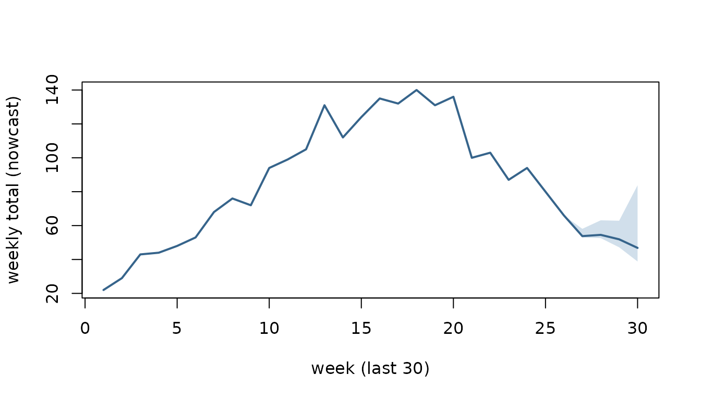

# The pipeline: from incomplete counts to published numbers

Surveillance counts arrive late. A case that belongs to week `W` may
only be reported in week `W`, `W+1`, `W+2`, and so on. So the newest
weeks always look lower than they will turn out to be. Anything you
measure on them — a trend, an intensity level, an alert — inherits that
dip.

This vignette runs one series through the whole of `csalert`. It fills
in the weeks that are still arriving, checks how far that filling can be
trusted, and ends with numbers you could publish.

Three shapes carry the run.

- **`csfmt_reporting_triangle_v3`** — the input. One cell per reference
  week and reporting DATE, so it records what was reported *when*. The
  delay is a number of days.
- **`csfmt_ensemble_v3`** — the working format. It holds `$data`, plus
  one matrix of Monte-Carlo `$draws` per measure (rows = weeks, columns
  = simulations). Each stage adds columns to the draws, so the
  uncertainty is carried forward rather than recomputed.
- a **quantile collapse** of those draws — the output, optionally
  *healed* into
  [`cstidy::csfmt_rts_data_v3`](https://niphr.github.io/cstidy/reference/set_csfmt_rts_data_v3.html)
  for the usual plots and tables.

## One rule: every stage takes the ensemble and returns it

That rule explains the shape of everything below.

> **Every analytical stage takes a `csfmt_ensemble_v3` and returns a
> `csfmt_ensemble_v3`**.
> [`ens_collapse()`](https://niphr.github.io/csalert/reference/ens_collapse.md)
> is **terminal**: it reduces the draws to quantiles, and a collapsed
> table is output, never input.

So the canonical pipeline is a single chain through the ensemble:

    csfmt_reporting_triangle_v3
      -> nowcast_delay_ecdf_v1  OR  nowcast_passthrough_to_ensemble_v1
      -> [ens_add_rate]              # when a denominator exists
      -> [short_term_trend]          # growth rate + P(increasing)
      -> [mem_thresholds_v1]         # MEM intensity
      -> [signal_detection_hlm]      # per-draw exceedance
      -> ens_collapse(heal = TRUE)   # ensemble -> quantiles -> csfmt_rts_data_v3

The bracketed stages are optional and order-flexible among themselves;
each one adds draw columns and hands the ensemble on. What you cannot do
is collapse and then carry on. A collapsed table holds quantiles, not
draws. Feed it back into
[`short_term_trend()`](https://niphr.github.io/csalert/reference/short_term_trend.md)
and you cannot recover a per-draw trend or a P(increasing). That is by
design, not a gap — the draws are the uncertainty, and the collapse is
where you spend them.

The series below is synthetic, and it runs the whole chain:

1.  **Nowcast** — fill in the recent weeks that are still being
    reported.
2.  **Validation** — replay the method against what was known in the
    past.
3.  **Reporting completion** — read the reporting delay off the triangle
    itself.
4.  **Rate** — a nowcasted numerator over a nowcasted denominator, per
    draw.
5.  **Short-term trend** — the recent slope of that rate, per draw.
6.  **MEM intensity** — seasonal intensity thresholds, classified per
    draw.
7.  **Signal detection** — historical-limits exceedance, per draw.
8.  **Collapse** — quantiles, healed into
    [`cstidy::csfmt_rts_data_v3`](https://niphr.github.io/cstidy/reference/set_csfmt_rts_data_v3.html).

Stages 4 to 8 are the ensemble chain above. Stages 2 and 3 are not. They
take the **triangle**, not the ensemble, because they ask about the
reporting process rather than about the completed counts. Keep that
split in mind. Anything that asks *how the data arrives* reads the
triangle; anything that asks *what the data says* reads the ensemble.

When you set up a *new* indicator, run stage 3 first: it is what
supports the choice of `max_delay_days` that everything else then uses.

``` r
library(data.table)
#> 
#> Attaching package: 'data.table'
#> The following object is masked from 'package:base':
#> 
#>     %notin%
library(csalert)
#> csalert 2026.9.22
#> https://niphr.github.io/csalert/
```

## A synthetic reporting triangle

Real surveillance data arrives with a delay: a case with reference week
`W` may only be *reported* a few days or a few weeks later. The
generator below simulates a laboratory indicator from ISO week 2019-35
to 2024-18. That span is five winter seasons, which is what stages 6 and
7 need. It has a **reporting speed-up built in at the start of ISO year
2024**. Stage 3 recovers that change from the triangle alone.

**The reporting axis is a calendar date, so a delay is a number of
days.** The generator draws a whole-week delay, then spreads the report
over the seven days of that reporting week. A report therefore lands
anywhere from day 0, the reference week’s own Monday, to day 34.

It emits a **numerator and a denominator**: tests taken, and how many
were positive. Simulating positives as a binomial *conditional on the
tests* keeps the numerator a subset of the denominator, which is what
makes their ratio a proportion. Two independent Poissons would not be.
Each test carries one reporting delay, so a result and its test land in
the same triangle cell.

[`set.seed()`](https://rdrr.io/r/base/Random.html) is called *inside*
the generator, not beside it. A seed set outside a function that is
called more than once leaves the second call running on a different
stream. The resulting Monte-Carlo noise reads as signal.

``` r
sim_reports <- function(first_ref = "2019-35",
                        last_ref = "2024-18",
                        delay_slow = c(0.45, 0.30, 0.15, 0.07, 0.03),
                        delay_fast = c(0.70, 0.20, 0.06, 0.03, 0.01),
                        seed = 1L) {
  set.seed(seed)                                    # pinned inside, see above
  weeks <- cstime::dates_by_isoyearweek$isoyearweek
  monday <- as.Date(cstime::dates_by_isoyearweek$mon)   # each week's own Monday
  i0 <- match(first_ref, weeks)
  i1 <- match(last_ref, weeks)
  rows <- lapply(i0:i1, function(ri) {
    ref <- weeks[ri]
    s <- cos(2 * pi * (cstime::isoyearweek_to_isoweek_n(ref) - 5) / 52)  # winter peak
    n_tests <- rpois(1, 400 + 120 * s)
    positive <- rbinom(n_tests, 1, stats::plogis(-2.2 + 1.1 * s))        # subset of tests
    p <- if (cstime::isoyearweek_to_isoyear_n(ref) <= 2023) delay_slow else delay_fast
    data.table(
      isoyearweek_reference = ref,
      # a whole-week delay, then a day inside that reporting week: delay day
      # 7 * weeks_late + day_of_week, so 0 to 34
      reporting_date = monday[ri] + 7L * sample(0:4, n_tests, TRUE, p) +
        sample(0:6, n_tests, TRUE),
      positive = positive
    )
  })
  # "today" is the last day of the last reference week: drop what has not been
  # reported yet, so the most recent weeks are still incomplete -- the problem a
  # nowcast solves
  rbindlist(rows)[reporting_date <= monday[i1] + 6L]
}

reports <- sim_reports()
triangle_long <- reports[, .(numerator = sum(positive), denominator = .N),
                         by = .(isoyearweek_reference, reporting_date)]
triangle_long[, `:=`(indicator_tag = "lab_flu", location_code = "nation",
                     age = "total", sex = "total")]
head(triangle_long, 4)
#>    isoyearweek_reference reporting_date numerator denominator indicator_tag
#>                   <char>         <Date>     <int>       <int>        <char>
#> 1:               2019-35     2019-08-30         0          24       lab_flu
#> 2:               2019-35     2019-08-26         1          16       lab_flu
#> 3:               2019-35     2019-08-29         0          21       lab_flu
#> 4:               2019-35     2019-08-27         0          16       lab_flu
#>    location_code    age    sex
#>           <char> <char> <char>
#> 1:        nation  total  total
#> 2:        nation  total  total
#> 3:        nation  total  total
#> 4:        nation  total  total
c(cells = nrow(triangle_long),
  numerator_never_exceeds_denominator =
    all(triangle_long$numerator <= triangle_long$denominator))
#>                               cells numerator_never_exceeds_denominator 
#>                                8079                                   1
```

Wrap it as a `csfmt_reporting_triangle_v3`. The as-of boundary is read
from the data: it is the newest reporting date present, not the system
clock. The constructor errors on a reporting column that is not a
`Date`, and on a missing reporting date.

``` r
tri <- csfmt_reporting_triangle_v3(
  triangle_long,
  id_cols       = c("indicator_tag", "location_code", "age", "sex"),
  reference_col = "isoyearweek_reference",
  reporting_col = "reporting_date",
  value_col     = "numerator"
)
c(as_of = attr(tri, "as_of"),
  newest_reporting_date = max(triangle_long$reporting_date))
#>                 as_of newest_reporting_date 
#>          "2024-05-05"          "2024-05-05"
```

`max_delay_days` is the delay horizon used by stages 1 to 3 below, in
DAYS. Stage 3 shows how to choose it from the data; 35 days is the right
answer for this series. Those 35 days are delay day 0 to delay day 34,
which is the five weeks that start on the reference week’s Monday.

``` r
max_delay_days <- 35L
```

## 1. Nowcast

**Estimand.** For each reference week, the total that will have been
reported at delay days `0 .. max_delay_days - 1`: that is, by the end of
the day `reference Monday + max_delay_days - 1`. This is a
horizon-capped total, **not** the eventual total. Anything reported
after delay day `max_delay_days - 1` is outside the estimand, and no
amount of nowcasting recovers it. Stage 3 is how you check that the
horizon is wide enough for the difference to be small. For a settled
week the quantity is already observed. For the most recent weeks it is
not, and the nowcast is a predictive distribution over it.

[`nowcast_delay_ecdf_v1()`](https://niphr.github.io/csalert/reference/nowcast_delay_ecdf_v1.md)
completes each incomplete week from a pooled **daily delay ECDF**. It
asks one question per reference week: what share of a week’s eventual
total has arrived by delay day `d`? It answers with an empirical
cumulative distribution pooled over the settled reference weeks, then
divides:

    p(d)           = cumsum(colSums(pool)) / sum(pool)
    total_hat[ref] = observed_so_far[ref] / p(d_observed[ref])

That pair is the closed-form maximum likelihood estimator of
`n[ref, d] ~ Poisson(lambda[ref] * p[d])`. The delay profile is
estimated saturated, one number per delay day, rather than through a
regression. A regression on 35 daily delay columns would have more
predictors than it has settled training rows.

The interval is empirical. Each settled week in the pool is re-completed
from its own first `d + 1` delay days, then compared with its settled
total. The 5 to 95 band is the point estimate, times the 5% and 95%
quantiles of that `truth / estimate` ratio. Nothing parametric is added
on top. `delay_window` (default 26 WEEKS, the one quantity here that is
not days) restricts training to the settled weeks within roughly that
span. The delay curve can then follow a reporting regime that changes,
as this series’ does.

`denominator_col` nowcasts a second measure alongside the numerator, on
the same draw axis. Stage 4 needs it: a rate is only coherent if both
its parts are completed in the same Monte-Carlo world.

``` r
set.seed(2)
ens <- nowcast_delay_ecdf_v1(tri, max_delay_days = max_delay_days, n_sim = 500,
                             denominator_col = "denominator")
ens
#> <csfmt_ensemble_v3> 245 rows | 1 series | draws: numerator_nowcasted, denominator_nowcasted
```

Collapse the draws to a quantile summary. `original` is the count
reported so far; the settled weeks sit exactly on it, the recent weeks
are completed above it.

``` r
q <- ens_collapse(ens, probs = c(0.05, 0.5, 0.95))
tail(q[, .(isoyearweek, original,
           lo  = numerator_nowcasted_q05x0,
           med = numerator_nowcasted_q50x0,
           hi  = numerator_nowcasted_q95x0)], 8)
#>    isoyearweek original       lo      med       hi
#>         <char>    <num>    <num>    <num>    <num>
#> 1:     2024-11       87 87.00000 87.00000 87.00000
#> 2:     2024-12       94 94.00000 94.00000 94.00000
#> 3:     2024-13       80 80.00000 80.00000 80.00000
#> 4:     2024-14       66 66.00000 66.00000 66.00000
#> 5:     2024-15       53 53.00000 53.79078 58.10309
#> 6:     2024-16       52 52.61077 54.53215 63.12222
#> 7:     2024-17       44 47.18014 51.90651 62.87138
#> 8:     2024-18       29 38.81167 46.83598 83.81000
```

The settled weeks are pinned to their observed total, so they have no
band at all. Only the incomplete weeks at the right-hand edge carry one:

``` r
show <- tail(q, 30)
xs   <- seq_len(nrow(show))
plot(xs, show$numerator_nowcasted_q50x0, type = "n",
     ylim = range(show$numerator_nowcasted_q05x0, show$numerator_nowcasted_q95x0),
     xlab = "week (last 30)", ylab = "weekly total (nowcast)")
polygon(c(xs, rev(xs)),
        c(show$numerator_nowcasted_q05x0, rev(show$numerator_nowcasted_q95x0)),
        col = grDevices::adjustcolor("steelblue", 0.25), border = NA)
lines(xs, show$numerator_nowcasted_q50x0, lwd = 2, col = "steelblue4")
```



Keep the reference weeks, and the Monday that starts each one. Every
delay and every age below is a number of days between two dates. The
later stages therefore need the Mondays, not the week labels.

``` r
weeks      <- cstime::dates_by_isoyearweek$isoyearweek
ref_weeks  <- q$isoyearweek
ref_monday <- as.Date(cstime::dates_by_isoyearweek$mon[match(ref_weeks, weeks)])
age        <- as.integer(attr(tri, "as_of") - ref_monday)   # age in DAYS
c(weeks = length(ref_weeks), oldest_age_days = max(age), newest_age_days = min(age))
#>           weeks oldest_age_days newest_age_days 
#>             245            1714               6
```

## 2. Validation: replay the method against the past

This stage and the next take the **triangle**, not the ensemble. They
ask how the data arrives. That is a property of the reporting process,
and it is destroyed the moment the delay axis is collapsed into weekly
totals.

The triangle records *when* every count arrived, to the day. So you can
reconstruct what was known on any past date and replay the engine
against it, without a second dated extract.

That reconstruction is exact only for an **append-only** reporting
system: one where a count, once filed, keeps its original reporting week
forever. Real systems also issue retrospective corrections, delete
records and reclassify cases. None of those leave a trace in the current
triangle. A case reclassified last month looks as though it was always
classified that way. Where such revisions matter, replay understates how
much the published numbers actually moved. A dated archive of extracts
is the only way to measure it.

[`nowcast_censor()`](https://niphr.github.io/csalert/reference/nowcast_censor.md)
does the rewind. It takes a `Date`, and returns a
`csfmt_reporting_triangle_v3` with every cell reported after that date
dropped and its as-of boundary moved back:

``` r
week_end <- ref_monday + 6L                       # the Sunday that ends each week
past <- nowcast_censor(tri, as_of = week_end[length(week_end) - 8L])
# format() first: c() on a Date and an integer coerces the integer to a Date
c(now  = format(attr(tri, "as_of")), then     = format(attr(past, "as_of")),
  rows_now = format(nrow(tri)),      rows_then = format(nrow(past)))
#>          now         then     rows_now    rows_then 
#> "2024-05-05" "2024-03-10"       "8079"       "7836"
```

[`nowcast_truth()`](https://niphr.github.io/csalert/reference/nowcast_truth.md)
supplies the target. It returns a two-column data.table (`reference`,
`truth`) of each reference week’s total summed over delay days
`0 .. max_delay_days - 1`, keeping only the weeks old enough for that
total to be settled. The newest weeks are absent by design: they have no
truth to be scored against yet.

``` r
truth <- nowcast_truth(tri, max_delay_days = max_delay_days)
tail(truth, 3)
#>    reference truth
#>       <char> <num>
#> 1:   2024-12    94
#> 2:   2024-13    80
#> 3:   2024-14    66
c(reference_weeks = length(ref_weeks), settled = nrow(truth))
#> reference_weeks         settled 
#>             245             241
```

A *method* is any function `f(triangle) -> csfmt_ensemble_v3` with its
own parameters baked in. That one-argument contract is what lets engines
with different signatures be replayed and compared through the same
harness.

`as_of_weeks` is a `Date` vector, and the function errors on anything
else. Replay as of the Sunday that ends each week, which is what “as of
week W” used to mean.

``` r
method_ecdf <- function(x) {
  nowcast_delay_ecdf_v1(x, max_delay_days = max_delay_days, n_sim = 500)
}
as_of_dates <- tail(week_end, 30)
```

[`nowcast_backtest()`](https://niphr.github.io/csalert/reference/nowcast_backtest.md)
runs the replay and returns the raw scored quantiles: one long row per
`reference` x `as_of` x `horizon` x `quantile_level`, with the predicted
value. `horizon` is whole weeks between the reference week and the as-of
date, so horizon 0 is the current, least-observed week.

``` r
bt <- nowcast_backtest(
  tri, method_ecdf,
  max_delay_days = max_delay_days,
  as_of_weeks    = as_of_dates,
  horizons       = 0:3,
  probs          = c(0.05, 0.25, 0.5, 0.75, 0.95),
  seed           = 1
)
head(bt, 4)
#>    reference      as_of horizon quantile_level predicted
#>       <char>     <Date>   <int>          <num>     <num>
#> 1:   2023-38 2023-10-15       3           0.05  19.00000
#> 2:   2023-39 2023-10-15       2           0.05  14.00000
#> 3:   2023-40 2023-10-15       1           0.05  17.62526
#> 4:   2023-41 2023-10-15       0           0.05  15.80000
nrow(bt)
#> [1] 600
```

[`nowcast_evaluate_v1()`](https://niphr.github.io/csalert/reference/nowcast_evaluate_v1.md)
wraps that replay and scores it, joining each forecast to its settled
truth. It returns one row per group (default: per horizon) per method:

- `n` — the number of scored forecasts behind that row.
- `coverage_50`, `coverage_90` — the **measured share of settled truths
  that fell inside the nominal 50% and 90% central intervals** on this
  replay. These are sample quantities, not a property of the
  construction.
- `median_signed`, `median_abs`, `q05`, `q95`, `p_gt_25`, `p_gt_50` —
  the revision of the published median relative to the settled truth, as
  a fraction of the truth. `median_signed` is the **median signed
  relative revision** across the replayed forecasts, not a mean, so it
  is not the bias in the usual expected-error sense. `p_gt_25` and
  `p_gt_50` are **empirical exceedance proportions**: the share of
  replayed forecasts whose absolute relative revision exceeded 0.25 and
  0.50. They are not probabilities of anything.

Passing a **named list** of methods replays every method over the same
reference and as-of weeks, so the comparison is paired **by forecast
unit**. `seed` makes each method’s own run reproducible. It does not by
itself create common random numbers across methods; that would need the
algorithms to consume compatible variates. Here it cannot:
[`nowcast_passthrough_to_ensemble_v1()`](https://niphr.github.io/csalert/reference/nowcast_passthrough_to_ensemble_v1.md)
draws no random numbers at all. Racing against it — it does no
completion and just republishes the counts reported so far — makes the
numbers readable:

``` r
ev <- nowcast_evaluate_v1(
  tri,
  methods = list(
    delay_ecdf  = method_ecdf,
    passthrough = function(x) {
      nowcast_passthrough_to_ensemble_v1(x, max_delay_days = max_delay_days)
    }
  ),
  max_delay_days = max_delay_days,
  as_of_weeks    = as_of_dates,
  horizons       = 0:3,
  seed           = 1
)
ev[, .(method, horizon, n, coverage_50, coverage_90, median_signed, median_abs)]
#>         method horizon     n coverage_50 coverage_90 median_signed median_abs
#>         <char>   <int> <int>       <num>       <num>         <num>      <num>
#> 1:  delay_ecdf       3    29       0.828       1.000        0.0089     0.0154
#> 2:  delay_ecdf       2    28       0.536       0.857        0.0328     0.0612
#> 3:  delay_ecdf       1    27       0.444       0.741        0.1135     0.1252
#> 4:  delay_ecdf       0    26       0.346       0.731        0.3889     0.4376
#> 5: passthrough       3    29       0.241       0.241       -0.0147     0.0147
#> 6: passthrough       2    28       0.036       0.036       -0.0630     0.0630
#> 7: passthrough       1    27       0.000       0.000       -0.1515     0.1515
#> 8: passthrough       0    26       0.000       0.000       -0.3543     0.3543
```

Read that table as a measurement on **this** sample and no further. Each
row rests on 26 to 29 scored weeks of one synthetic series. That is far
too few to characterise either engine. A coverage estimate from 26
scored weeks has a standard error of roughly 0.06 at 0.9 and 0.10 at
0.5. That is before any dependence between overlapping windows is
allowed for.

What the comparison does show is the *shape* of the problem. What
construction guarantees for the passthrough is only this: each of its
forecasts is **no greater** than the settled truth. A count that is
still arriving cannot exceed its own total. Every individual revision is
therefore zero or negative.

That alone does not force a strictly negative *median* at a given
horizon. If more than half the weeks were already complete, the median
would be exactly zero. It also does not order the horizons. The negative
`median_signed` at all four horizons, and horizon 0 being the worst, are
findings on this sample, not consequences of the construction.

Its `coverage_50` and `coverage_90` are equal because a single draw
gives it no interval at all. The “interval” is a point. It covers the
truth only when the republished count already equals it. At horizon 3
that happens on the weeks where nothing arrived on delay days 28 to 34.

### The engine’s horizon-0 row is worth stopping on

The `delay_ecdf` engine covers 0.731 of the settled truths at horizon 0
against a nominal 0.90, and its `median_signed` is *positive* at 0.389.
It is over-completing. That is not a random dip. The replay window above
ends at the as-of date, so it straddles the reporting speed-up this
series has at the start of ISO 2024. `delay_window` holds training to
the settled weeks of roughly the preceding 26 weeks. Learn the delay
curve of a slow regime, then apply it to partial counts from a fast one.
You scale up counts that were already nearly complete.

The contrast is visible if the replay is restricted to as-of weeks that
sit entirely inside the slow regime:

``` r
slow_dates <- tail(week_end[cstime::isoyearweek_to_isoyear_n(ref_weeks) == 2023], 30)
c(from = slow_dates[1], to = slow_dates[length(slow_dates)])
#>         from           to 
#> "2023-06-11" "2023-12-31"
nowcast_evaluate_v1(tri, method_ecdf, max_delay_days = max_delay_days,
                    as_of_weeks = slow_dates, horizons = 0:3, seed = 1)[
  , .(horizon, n, coverage_50, coverage_90, median_signed, median_abs)]
#>    horizon     n coverage_50 coverage_90 median_signed median_abs
#>      <int> <int>       <num>       <num>         <num>      <num>
#> 1:       3    30       0.367       0.733        0.0141     0.0394
#> 2:       2    30       0.467       0.767       -0.0154     0.0453
#> 3:       1    30       0.500       0.800       -0.0027     0.0451
#> 4:       0    30       0.467       0.800       -0.0072     0.1896
```

Horizon 0 recovers, and the bias changes sign. Read that as a
demonstration of the mechanism, not as a measured effect size. The two
windows also differ in which weeks and which part of the season they
cover. A sample of 26 to 30 scored weeks cannot separate those from the
regime change. The general lesson is the one `delay_window` exists for:
**a nowcast engine is only as current as the reporting behaviour it was
trained on**. Stage 3 is how you find out when that behaviour moved.

[`nowcast_estimate_calibration_v1()`](https://niphr.github.io/csalert/reference/nowcast_estimate_calibration_v1.md)
reports the same per-horizon coverage alongside an interval-scaling
factor learned from the replay. Its documentation is explicit that this
is an empirical rescaling and not split conformal, so the factor carries
no finite-sample coverage guarantee.

## 3. Reporting completion: how fast does the data actually arrive?

### What `pct_delayD` counts

**The delay axis is DAYS.** `pct_delay0` is the share of a reference
week’s cases reported on that week’s own Monday. In general:

> `pct_delayD` is the pooled share of a reference week’s cases reported
> by the end of the day `reference Monday + D`.

The columns are indexed by **delay day**, 0-based, so the index in the
name is the delay it reports. There are exactly `max_delay_days` of
them, and the highest is `pct_delay<max_delay_days - 1>`. Each is the
delay ECDF read at one day, with no interpolation. `mean_delay` is on
the same axis and in DAYS.

Five of the 35 columns fall on the end of an ISO week, and those are the
ones a weekly reader wants: `pct_delay6`, `pct_delay13`, `pct_delay20`,
`pct_delay27` and `pct_delay34`. `pct_delay6` is the share in by the end
of the reference week itself. The other four are the ends of the four
weeks after it.

A triangle with a known answer settles it. Below, each reference week
generates exactly 50 on delay day 0, 30 on delay day 7 and 20 on delay
day 14. The result is right-truncated at the newest reporting date, the
way real data is:

``` r
pin_monday <- as.Date("2023-01-02") + 7 * rep(0:29, each = 3)
pin <- data.table(
  isoyearweek_reference = format(pin_monday, "%G-%V"),
  reporting_date = pin_monday + rep(c(0, 7, 14), 30),
  numerator = rep(c(50, 30, 20), 30),
  indicator = "pinned", location = "nation", age = "total", sex = "total"
)
pin <- pin[reporting_date <= as.Date("2023-01-02") + 7 * 29]
tri_pin <- csfmt_reporting_triangle_v3(
  pin, id_cols = c("indicator", "location", "age", "sex")
)
reporting_completion_v1(tri_pin, max_delay_days = 15)[
  , .(n_settled, mean_delay, complete_by_md, pct_delay0, pct_delay7, pct_delay14)]
#>    n_settled mean_delay complete_by_md pct_delay0 pct_delay7 pct_delay14
#>        <int>      <num>          <num>      <num>      <num>       <num>
#> 1:        28        4.9              1         50         80         100
```

`pct_delay0` is 50, not 80: it is the delay-day-0 share, the reports
that arrived on the reference week’s own Monday. `pct_delay7` is 80,
cumulative through delay day 7. `mean_delay` is
`0*0.50 + 7*0.30 + 14*0.20 = 4.9` days.

**Coming from an older script?** These columns used to be indexed by
WEEK. A `pct_delay1` on the old weekly axis meant “in by the end of the
week after the reference week”, which is now `pct_delay13`. The column
names did not change shape, only their unit, so old code reads a column
that exists and gets a different quantity. Re-read every `pct_delayD`
you use.

`n_settled` is 28, not 30. Age eligibility is the first filter. A
reference week is eligible once
`as_of - reference Monday >= max_delay_days - 1` days, which excludes
the two most recent of those 30. A second filter then drops any eligible
week whose total within the horizon is zero, and `n_settled` counts what
survives both. Here no week is empty, so the age rule alone accounts for
the number, and the same holds on the working triangle:

``` r
completion <- reporting_completion_v1(tri, max_delay_days = max_delay_days)
c(age_eligible = sum(age >= max_delay_days - 1L), reported = completion$n_settled)
#> age_eligible     reported 
#>          241          241
```

They agree only because this series has no zero-count weeks. On an
indicator with quiet weeks — a rare pathogen, a small stratum —
`n_settled` will be the smaller of the two. A period slice with fewer
than three surviving weeks is dropped from the output entirely.

### A worked reference week

Take reference week **2023-07**. `cstime` gives its calendar dates, and
the two weeks after it:

``` r
cstime::dates_by_isoyearweek[
  isoyearweek %in% c("2023-07", "2023-08", "2023-09"),
  .(isoyearweek, isoyear, mon, thu, sun)
]
#>    isoyearweek isoyear        mon        thu        sun
#>         <char>   <int>     <Date>     <Date>     <Date>
#> 1:     2023-07    2023 2023-02-13 2023-02-16 2023-02-19
#> 2:     2023-08    2023 2023-02-20 2023-02-23 2023-02-26
#> 3:     2023-09    2023 2023-02-27 2023-03-02 2023-03-05
```

For a case whose reference week is 2023-07:

| statistic     | covers reports up to            | which is          |
|---------------|---------------------------------|-------------------|
| `pct_delay0`  | the reference week’s own Monday | Monday 2023-02-13 |
| `pct_delay6`  | end of ISO week 2023-07         | Sunday 2023-02-19 |
| `pct_delay13` | end of ISO week 2023-08         | Sunday 2023-02-26 |
| `pct_delay20` | end of ISO week 2023-09         | Sunday 2023-03-05 |

So `pct_delay6` is a statement about the seven days from Monday
2023-02-13. `pct_delay13` is about the **14** days from that same
Monday, not the seven days of week 2023-08 on their own. The columns are
cumulative.

### Which day of the week you run it on

**The day of the week now changes the delay arithmetic.** Delay is the
number of days from the reference week’s Monday to the reporting date.
The seven days of one reporting week land in seven different delay
buckets:

``` r
days <- seq(as.Date("2023-02-13"), as.Date("2023-02-19"), by = "day")
data.table(date = days, weekday = weekdays(days),
           delay_day_for_2023_07 = as.integer(days - as.Date("2023-02-13")))
#>          date   weekday delay_day_for_2023_07
#>        <Date>    <char>                 <int>
#> 1: 2023-02-13    Monday                     0
#> 2: 2023-02-14   Tuesday                     1
#> 3: 2023-02-15 Wednesday                     2
#> 4: 2023-02-16  Thursday                     3
#> 5: 2023-02-17    Friday                     4
#> 6: 2023-02-18  Saturday                     5
#> 7: 2023-02-19    Sunday                     6
```

That is what the daily axis changed. On the old weekly axis all seven of
those days carried one label and shared one bucket.

Nothing in the pipeline reads the system clock: the as-of boundary comes
from the newest reporting date *present in the data*. `as_of` is
`max(reporting_date)`. A Monday extract and the Sunday extract of the
same week give two different as-of dates. Every reference week’s age in
DAYS moves with them.

[`nowcast_censor()`](https://niphr.github.io/csalert/reference/nowcast_censor.md)
is the exact way to see what a Monday extract would have held. It drops
every cell reported after the given date:

``` r
monday_as_of <- attr(tri, "as_of") - 6L         # the Monday of the as-of week
tri_mon <- nowcast_censor(tri, as_of = monday_as_of)

rbind(
  cbind(extract = "Sunday (week complete)",
        reporting_completion_v1(tri, max_delay_days = max_delay_days)[
          , .(n_settled, mean_delay, pct_delay6, pct_delay13, pct_delay20, pct_delay27)]),
  cbind(extract = "Monday (six days earlier)",
        reporting_completion_v1(tri_mon, max_delay_days = max_delay_days)[
          , .(n_settled, mean_delay, pct_delay6, pct_delay13, pct_delay20, pct_delay27)])
)
#>                      extract n_settled mean_delay pct_delay6 pct_delay13
#>                       <char>     <int>      <num>      <num>       <num>
#> 1:    Sunday (week complete)       241       9.15       47.9        76.8
#> 2: Monday (six days earlier)       240       9.16       47.8        76.7
#>    pct_delay20 pct_delay27
#>          <num>       <num>
#> 1:        90.6          97
#> 2:        90.6          97
```

The pooled curve barely moves. `n_settled` does move, and that is the
age test working rather than failing. A week is eligible once
`as_of - reference Monday >= max_delay_days - 1`. Pulling `as_of` back
six days pulls the settled boundary back with it.

One reference week is at risk of an understated total, and it is the
newest settled one. Its age is exactly `max_delay_days - 1`, so its last
delay cell falls on the extract day itself and is still filling. Every
older week finished reporting earlier; every newer week is not settled.
Count the weeks that actually moved, rather than assuming it is one:

``` r
truth_sun <- nowcast_truth(tri, max_delay_days)
truth_mon <- nowcast_truth(tri_mon, max_delay_days)
cmp <- merge(truth_sun, truth_mon, by = "reference",
             suffixes = c("_sunday", "_monday"))
c(settled_sunday = nrow(truth_sun), settled_monday = nrow(truth_mon),
  in_both = nrow(cmp), totals_that_moved = nrow(cmp[truth_sunday != truth_monday]))
#>    settled_sunday    settled_monday           in_both totals_that_moved 
#>               241               240               240                 0
```

The reason is worth seeing, because it bounds the whole effect. The only
cell at risk is the delay-34 numerator of the newest settled week, which
is what arrived on the extract day itself:

``` r
newest_settled <- ref_weeks[max(which(age >= max_delay_days - 1L))]
triangle_long[isoyearweek_reference == newest_settled &
              reporting_date == attr(tri, "as_of"),
              .(isoyearweek_reference, reporting_date, numerator, denominator)]
#> Empty data.table (0 rows and 4 cols): isoyearweek_reference,reporting_date,numerator,denominator
```

Nothing arrived in that cell, so this week’s settled total cannot move
at all. **The weekday effect is bounded by the mass sitting in the last
delay cell**. Widen `max_delay_days` past where reporting actually
finishes and that cell empties. A daily axis makes the cell one day wide
rather than one week wide, so there is less mass in it to lose.

**None of this generalises, and the reason it is small here is about
scale**. The at-risk cell is one week’s last delay day, diluted into a
pool of hundreds of settled weeks. Shrink the series, shrink the
horizon, or give the indicator a heavier reporting tail, and the same
mechanism becomes material. A period slice with the minimum three
qualifying weeks gives that one cell a third of the weight.

The general statement is the conditional one. A mid-week extract
undercounts the newest settled week’s total by whatever share of its
last delay cell has not arrived. That total is what
[`nowcast_truth()`](https://niphr.github.io/csalert/reference/nowcast_truth.md)
scores a backtest against. So run the backtest off an end-of-day
extract, and record which day it was.

### “As of today”, for the weeks on screen

With `as_of` = 2024-05-05 and `max_delay_days` = 35, the reference weeks
split three ways:

``` r
data.table(
  isoyearweek = ref_weeks,
  days_observed = age + 1L,
  status = fifelse(age >= max_delay_days - 1L, "settled",
           fifelse(age >= 7L, "still filling", "current week"))
)[, .N, keyby = status]
#> Key: <status>
#>           status     N
#>           <char> <int>
#> 1:  current week     1
#> 2:       settled   241
#> 3: still filling     3
```

The weeks that are not settled are the ones the nowcast in stage 1
completed, and the ones the completion table declines to learn from. The
completed weeks are the ones whose nowcast rises above the count
reported so far:

``` r
q[numerator_nowcasted_q95x0 > original, isoyearweek]
#> [1] "2024-15" "2024-16" "2024-17" "2024-18"
```

### Reporting drift: `period = "year"`

`period = "year"` returns **one row per qualifying ISO year**, and it is
how you see a reporting system speeding up or slowing down. One pooled
curve cannot: it averages the regimes together and describes neither.

“Qualifying” is load-bearing. A period slice needs at least three
settled weeks with a non-zero within-horizon total. A slice below that
is dropped from the result, with no warning and no placeholder row. A
year at the edge of the series — the one your data starts or ends in —
is the usual casualty. A missing year means too few weeks, never zero
delay.

``` r
reporting_completion_v1(tri, max_delay_days = max_delay_days, period = "year")[
  , .(period, n_settled, mean_delay, pct_delay6, pct_delay13, pct_delay20, pct_delay27)]
#>    period n_settled mean_delay pct_delay6 pct_delay13 pct_delay20 pct_delay27
#>    <char>     <int>      <num>      <num>       <num>       <num>       <num>
#> 1:   2019        18       9.38       47.3        73.8        91.0        96.9
#> 2:   2020        53       9.61       44.7        74.8        89.7        96.8
#> 3:   2021        52       9.27       45.9        76.5        90.7        97.1
#> 4:   2022        52       9.67       44.3        74.5        89.6        96.8
#> 5:   2023        52       9.65       44.6        75.0        89.1        96.3
#> 6:   2024        14       6.06       70.7        90.2        96.4        98.9
```

That is the change built into `sim_reports()`, recovered from the
triangle. Read `pct_delay6`, the share in by the end of the reference
week itself. It runs 47.3, 44.7, 45.9, 44.3 and 44.6 across ISO 2019 to
2023, then steps to 70.7 in 2024. `mean_delay` steps the other way, from
about 9.5 days to 6.06. A flat run followed by a step is what a genuine
regime change looks like. A single year out of line with its neighbours
is usually noise.

The pooled `pct_delay6` of 47.9 sits just above every one of those slow
years. The slow weeks outnumber the fast ones 227 to 14. So the pooled
curve is the old regime with a little contamination, not a compromise
between the two. It will drift year by year as 2024 accumulates weeks.

The stratification is by **ISO year**, not calendar year, and the ISO
year of a week is the calendar year of its Thursday. That decides which
year owns a boundary week:

``` r
cstime::dates_by_isoyearweek[
  isoyearweek %in% c("2022-52", "2023-01"), .(isoyearweek, isoyear, mon, thu, sun)
]
#>    isoyearweek isoyear        mon        thu        sun
#>         <char>   <int>     <Date>     <Date>     <Date>
#> 1:     2022-52    2022 2022-12-26 2022-12-29 2023-01-01
#> 2:     2023-01    2023 2023-01-02 2023-01-05 2023-01-08
```

ISO week 2022-52 has its Thursday on 2022-12-29, so it belongs to ISO
year 2022 even though its Sunday, 2023-01-01, is a calendar-2023 date.
ISO week 2023-01 has its Thursday on 2023-01-05 and belongs to 2023.

`period = "month"` slices finer and localises *when* a change happened.
It uses the same Thursday rule to decide which calendar month owns a
week that straddles two:

``` r
tail(reporting_completion_v1(tri, max_delay_days = max_delay_days, period = "month")[
  , .(period, n_settled, mean_delay, pct_delay6, pct_delay13)], 6)
#>     period n_settled mean_delay pct_delay6 pct_delay13
#>     <char>     <int>      <num>      <num>       <num>
#> 1: 2023-10         4      10.36       39.1        73.9
#> 2: 2023-11         5      10.10       39.4        71.6
#> 3: 2023-12         4       9.77       43.5        75.4
#> 4: 2024-01         4       5.68       72.9        92.4
#> 5: 2024-02         5       6.40       69.3        88.7
#> 6: 2024-03         4       5.90       70.1        90.7
```

The step lands between 2023-12 and 2024-01. Note the small `n_settled`
per month, four or five weeks, so a single month’s row is noisy. Read
the sequence, not one row.

### Every number here is conditional on `max_delay_days`

This is the trap, and it is structural rather than a tuning subtlety.
[`reporting_completion_v1()`](https://niphr.github.io/csalert/reference/reporting_completion_v1.md)
works from a triangle that has already had every cell with delay
`>= max_delay_days` discarded. So the denominator is the total that
arrived *within the horizon*, not the eventual total. Two consequences
follow, and they hold whatever the real reporting tail looks like:

- `complete_by_md` is the last cumulative fraction of that same
  truncated total, so it is 1.
- the last column, `pct_delay<max_delay_days - 1>`, is that fraction as
  a percentage, so it is 100.

Neither can detect reporting that dribbles in past the horizon. Rather
than assert that, check it. The sweep below runs one to eight weeks of
horizon, in days, and reads the last column by name each time:

``` r
sens <- rbindlist(lapply(7L * (1:8), function(md) {
  r <- reporting_completion_v1(tri, max_delay_days = md)
  data.table(max_delay_days = md, n_settled = r$n_settled,
             mean_delay = r$mean_delay, complete_by_md = r$complete_by_md,
             last_col = paste0("pct_delay", md - 1L),
             last_pct = r[[paste0("pct_delay", md - 1L)]],
             pct_delay6 = r$pct_delay6, pct_delay13 = r$pct_delay13)
}), fill = TRUE)
sens
#>    max_delay_days n_settled mean_delay complete_by_md    last_col last_pct
#>             <int>     <int>      <num>          <num>      <char>    <num>
#> 1:              7       244       2.98              1  pct_delay6      100
#> 2:             14       244       5.60              1 pct_delay13      100
#> 3:             21       243       7.34              1 pct_delay20      100
#> 4:             28       242       8.45              1 pct_delay27      100
#> 5:             35       241       9.15              1 pct_delay34      100
#> 6:             42       240       9.16              1 pct_delay41      100
#> 7:             49       239       9.18              1 pct_delay48      100
#> 8:             56       238       9.20              1 pct_delay55      100
#>    pct_delay6 pct_delay13
#>         <num>       <num>
#> 1:      100.0          NA
#> 2:       62.6       100.0
#> 3:       53.1        84.8
#> 4:       49.5        79.2
#> 5:       47.9        76.8
#> 6:       47.8        76.7
#> 7:       47.7        76.6
#> 8:       47.6        76.6
c(complete_by_md_always_1 = all(sens$complete_by_md == 1),
  last_pct_always_100     = all(sens$last_pct == 100))
#> complete_by_md_always_1     last_pct_always_100 
#>                    TRUE                    TRUE
```

The same holds inside every period slice, which is where it is easiest
to mistake for a finding:

``` r
per <- rbindlist(lapply(c("all", "year", "month"), function(p) {
  r <- reporting_completion_v1(tri, max_delay_days = max_delay_days, period = p)
  data.table(period_arg = p, rows = nrow(r),
             complete_by_md_all_1 = all(r$complete_by_md == 1),
             pct_delay34_all_100 = all(r$pct_delay34 == 100))
}))
per
#>    period_arg  rows complete_by_md_all_1 pct_delay34_all_100
#>        <char> <int>               <lgcl>              <lgcl>
#> 1:        all     1                 TRUE                TRUE
#> 2:       year     6                 TRUE                TRUE
#> 3:      month    55                 TRUE                TRUE
```

**The diagnostic that does work is the `max_delay_days` sweep itself**.
Read the `sens` table above down its rows. `mean_delay` climbs from 2.98
days at a 7-day horizon to 9.15 at 35 days, then moves only to 9.20 at
56. `pct_delay6` falls from 100 to 47.9 and then drifts to 47.6. That
flattening is what *supports* `max_delay_days <- 35L` here. It is a
sensitivity analysis, not a proof.

A `mean_delay` that kept climbing would be clear evidence the tail was
still being cut off. A plateau is weaker evidence in the other
direction, because a genuinely sparse tail and a shifting settled-week
composition both flatten the curve too.

Two cautions on reading that sweep:

- The short horizons are not merely imprecise, they are biased
  optimistic. `pct_delay6` at a 7-day horizon conditions on the cases
  that arrived within one week. That is a smaller denominator, so a
  larger share.
- Not all of the residual movement past 35 days is about the tail.
  `n_settled` falls across those rows, because a longer horizon settles
  fewer weeks. The weeks it drops are the newest, which on this series
  are the fast-reporting ones. That pulls the pooled `pct_delay6` down
  slightly on composition alone. Compare rows at equal `n_settled`, or
  read `period = "year"` instead, before calling a small drift a tail.

`sim_reports()` emits no delay beyond day 34. So on *this* triangle a
horizon of 35 days truncates nothing, and the flattening really is
exact. That is only knowable because we can read the generator. On a
real series that check is unavailable. Widen until `mean_delay` stops
moving, then treat the remaining tail as bounded by what a still-wider
horizon would have shown, not as zero.

## 4. Rate: a nowcasted numerator over a nowcasted denominator

From here on every stage takes the ensemble and returns the ensemble.

**Estimand.** The percentage of tests that were positive, per reference
week. It is computed **per draw**, so it carries the uncertainty of both
the numerator and the denominator. Collapsing first and dividing the
medians would throw that away and give a ratio no draw ever produced.

Because draws are index-aligned across measures (column `j` is the same
Monte-Carlo world for every measure), the division is element-wise:

``` r
ens <- ens_add_rate(ens,
                    numerator   = "numerator_nowcasted",
                    denominator = "denominator_nowcasted",
                    per         = 100)
names(ens$draws)
#> [1] "numerator_nowcasted"                               
#> [2] "denominator_nowcasted"                             
#> [3] "numerator_nowcasted_vs_denominator_nowcasted_pr100"
```

The new measure’s name is built by the grammar, not pasted, so build it
the same way rather than typing it out:

``` r
rate <- csfmt_var("numerator_nowcasted", denom = "denominator_nowcasted", per = 100)
rate
#> [1] "numerator_nowcasted_vs_denominator_nowcasted_pr100"
```

``` r
qr <- ens_collapse(ens, probs = c(0.05, 0.5, 0.95))
tail(qr[, .(isoyearweek,
            positives = numerator_nowcasted_q50x0,
            tests     = denominator_nowcasted_q50x0,
            pct_lo    = round(get(csfmt_var(rate, q = 0.05)), 2),
            pct       = round(get(csfmt_var(rate, q = 0.50)), 2),
            pct_hi    = round(get(csfmt_var(rate, q = 0.95)), 2))], 6)
#>    isoyearweek positives    tests pct_lo   pct pct_hi
#>         <char>     <num>    <num>  <num> <num>  <num>
#> 1:     2024-13  80.00000 482.0000  16.60 16.60  16.60
#> 2:     2024-14  66.00000 440.0000  15.00 15.00  15.00
#> 3:     2024-15  53.79078 433.1894  12.05 12.41  13.28
#> 4:     2024-16  54.53215 445.1033  11.23 12.39  14.23
#> 5:     2024-17  51.90651 392.3792  10.26 12.88  16.19
#> 6:     2024-18  46.83598 427.9788   6.04 10.42  20.19
```

Two guards are worth knowing about. A denominator of zero gives `NA`,
not a fabricated 0% that would read as a real drop. The numerator is a
subset of the denominator, so the rate is capped at `per`. A draw that
violated that cap would warn rather than silently exceed 100%.

No warning appeared above, so no draw did. But the numerator and
denominator here are nowcast **independently**, and nothing in the
engine enforces coherence between them. On a series where the two are
close, expect that warning.

## 5. Short-term trend on the rate

**Estimand.** The OLS slope of the *completed* series over the last
`trend_isoyearweeks` weeks, and that slope as a percentage of the
current level. This is a **descriptive** quantity: a summary of the six
numbers in the window, not an estimate of a latent growth parameter.
Read per draw, it inherits exactly the uncertainty the nowcast put into
those six numbers, and no other.

Run the trend on the nowcast rather than on the reported counts. That is
the point of the pipeline. The reported counts turn down at the
right-hand edge simply because the reports have not arrived. A trend
fitted to them reports a fall that is an artefact of reporting.

The method returns a slope, a growth rate and the fraction of draws
whose slope is positive. It does **not** return an increasing /
not-increasing classification; if you want one, you choose the cut-off
on that fraction yourself. (The
[`cstidy::csfmt_rts_data_v1`](https://niphr.github.io/cstidy/reference/set_csfmt_rts_data_v1.html)
method of
[`short_term_trend()`](https://niphr.github.io/csalert/reference/short_term_trend.md)
does return a status factor — a different estimator, discussed at the
end of this section).

The ensemble method fits, independently down every draw column, a
closed-form OLS straight line through that draw’s last
`trend_isoyearweeks` nowcasted counts. It adds two draw matrices and one
point column:

``` r
ens_trend <- short_term_trend(ens, measure = rate, trend_isoyearweeks = 6)
setdiff(names(ens_trend$draws), names(ens$draws))
#> [1] "numerator_nowcasted_vs_denominator_nowcasted_pr100_trend_beta1"
#> [2] "numerator_nowcasted_vs_denominator_nowcasted_pr100_trend_gr"
setdiff(names(ens_trend$data), names(ens$data))
#> character(0)
```

- `..._trend_beta1` — the OLS slope, in percentage points per week, per
  draw.
- `..._trend_gr` — the growth rate `100 * slope / level`, per draw, in
  percent of the current level per week.
- `..._trend_increasing_pr` — the share of draws with a positive slope.
  It is already a reduction over the draw axis, so it lives on `$data`
  and is not collapsed.

Collapse as usual:

``` r
gr <- csfmt_var(rate, role = "trend", suffix = "_gr")
qt <- ens_collapse(ens_trend, probs = c(0.05, 0.5, 0.95))
trend <- qt[, .(isoyearweek,
                gr    = round(get(csfmt_var(gr, q = 0.50)), 2),
                gr_lo = round(get(csfmt_var(gr, q = 0.05)), 2),
                gr_hi = round(get(csfmt_var(gr, q = 0.95)), 2),
                p_increasing = get(csfmt_var(rate, role = "trend",
                                             suffix = "_increasing_pr")))]
tail(trend, 10)
#>     isoyearweek     gr  gr_lo gr_hi p_increasing
#>          <char>  <num>  <num> <num>        <num>
#>  1:     2024-09  -1.95  -7.86  4.07        0.262
#>  2:     2024-10  -5.17 -11.05  1.34        0.082
#>  3:     2024-11  -7.37 -13.76 -1.13        0.036
#>  4:     2024-12  -8.59 -14.58 -2.67        0.016
#>  5:     2024-13 -10.82 -18.05 -5.02        0.002
#>  6:     2024-14  -7.51  -9.94 -4.99        0.004
#>  7:     2024-15 -12.62 -16.07 -9.25        0.000
#>  8:     2024-16 -12.99 -17.25 -8.51        0.002
#>  9:     2024-17 -10.71 -18.07 -2.22        0.022
#> 10:     2024-18  -9.10 -31.17  5.14        0.138
```

The last four rows are the nowcast weeks. Every one of their point
estimates is negative. The bands widen toward the right-hand edge: three
of the four sit entirely below zero, and the newest week’s runs from
-31.17 to 5.14 with `p_increasing` at 0.138. The series is on the spring
side of its winter peak. Only on the newest week is the nowcast
uncertainty wide enough to admit a rise.

Note what that statement is and is not: it says the *completed* rate
fell over each six-week window, given this nowcast. It does not say the
fall will continue. It is conditional on the nowcast being right about
the four weeks that are still filling. Stage 2 measured those weeks as
the engine’s weakest point.

### Every week gets an interval, including the settled ones

Two things are uncertain and both reach the draws.

The first is the **level**. A week still filling in has a nowcast, so
its numerator and denominator differ from draw to draw. A settled week
does not: every draw of the observed total is the same number.

The second is the **line** fitted through those levels. That one is
never certain, not even when the six weekly rates are known exactly. Six
known points do not determine the slope of the process that generated
them, and
[`short_term_trend()`](https://niphr.github.io/csalert/reference/short_term_trend.md)
therefore always adds the slope’s own sampling error, `se * reference`,
to each draw before forming the growth rate.

That was optional until 2026.8.27, and off by default. It is neither
now, for one reason: `p_increasing` is the share of draws whose slope is
positive. Without the slope’s error a settled week has one slope
repeated across every draw, so that share is exactly 0 or 1 for *every*
settled week, and a threshold on it does nothing at all. A column named
for a probability was reporting a sign indicator.

``` r
settled_weeks <- truth$reference
tr_settled <- trend[isoyearweek %in% settled_weeks & !is.na(gr_lo)]
p <- tr_settled$p_increasing
data.table(
  settled_rows_with_a_full_window = nrow(tr_settled),
  any_degenerate_interval = any(tr_settled$gr_lo == tr_settled$gr_hi),
  p_increasing_strictly_inside_0_1 = sum(p > 0 & p < 1),
  p_increasing_at_a_boundary = sum(p %in% c(0, 1))
)
#>    settled_rows_with_a_full_window any_degenerate_interval
#>                              <int>                  <lgcl>
#> 1:                             236                   FALSE
#>    p_increasing_strictly_inside_0_1 p_increasing_at_a_boundary
#>                               <int>                      <int>
#> 1:                              223                         13
```

Every settled week now has a real interval. Most also have a
`p_increasing` strictly between 0 and 1. The remainder sit at exactly 0
or 1, and that is a different thing from the old degeneracy: those are
windows whose slope is so many standard errors from zero that every draw
lands on the same side. That is a probability of 1 at the Monte Carlo
resolution the draw count buys, not a sign indicator. Raise `n_sim` if
you need to distinguish 0.999 from 1.

### What that interval is, and what it is not

Adding the slope’s error answers a **model-based** question: *treat the
six weekly counts as noisy observations around a latent straight line,
and report uncertainty about that line’s slope*. That question is the
one a trend arrow asks. Asking it commits you to three assumptions:

1.  the underlying weekly mean is **linear** across the window;
2.  the deviations are **independent** across weeks;
3.  they are **homoskedastic**, with the reference distribution
    `error_reference` names.

None of the three holds for the series in this vignette. `sim_reports()`
draws tests from a Poisson and positives from a binomial, both with a
**sinusoidal** mean. So the window mean is curved rather than linear,
and the variance of the rate changes with the level and with the number
of tests. Read the interval as a statement about the sensitivity of the
slope, not as a validated confidence interval, and say which you mean
when you publish it.

There is a practical trap on top of the assumptions. Under
`error_reference = "auto"` the identity and quasi-Poisson families use a
t on `trend_isoyearweeks - 2` degrees of freedom, which is 4 at the
width of 6 used here. At the function’s own default width of 3 it is 1,
a Cauchy: the growth-rate quantiles then have no finite variance and
very heavy tails. Widen the window, or pass
`error_reference = "normal"`, which is what a Wald interval uses and
what a pipeline built on
[`stats::confint()`](https://rdrr.io/r/stats/confint.html) matches.

Width 2 is refused outright for those two families. Both read a
dispersion off `width - 2` residual degrees of freedom, so at width 2
there are none and `se` has no value. `family = "binomial"` fixes the
dispersion at 1 and accepts width 2.

This ensemble method is not the same estimator as
[`short_term_trend()`](https://niphr.github.io/csalert/reference/short_term_trend.md)
on a
[`cstidy::csfmt_rts_data_v1`](https://niphr.github.io/cstidy/reference/set_csfmt_rts_data_v1.html).
That one fits a quasi-Poisson log-link model over a moving window and
returns a factor status column (`increasing` / `notincreasing`),
following Benedetti (2019); see
[`?short_term_trend`](https://niphr.github.io/csalert/reference/short_term_trend.md).
The ensemble method here defaults to an OLS slope. That default was
chosen because it is a fixed linear filter, and so can be applied down
500 draw columns at once. `family = "quasipoisson"` gives it the same
log link the deprecated method uses, at the same cost, by running the
iteration as a filter too. **The `csfmt_rts_data_v1` method is the
pre-ensemble architecture and is deprecated**. New work SHOULD run
[`short_term_trend()`](https://niphr.github.io/csalert/reference/short_term_trend.md)
on the ensemble, as above, before
[`ens_collapse()`](https://niphr.github.io/csalert/reference/ens_collapse.md).

Carry the trend ensemble forward — the chain continues from here:

``` r
ens <- ens_trend
```

## 6. MEM intensity thresholds

**Estimand.** Which of five seasonal intensity levels this week’s rate
falls in. The thresholds come from the *same series’ own previous
seasons*, via the Moving Epidemic Method. Classification happens per
draw, so the answer is a distribution over levels rather than one label.

This is the first stage that needs **history**, and a lot of it.
[`mem_thresholds_v1()`](https://niphr.github.io/csalert/reference/mem_thresholds_v1.md)
needs complete prior seasons to fit a season’s thresholds. `min_seasons`
(default 2) is a hard floor. `prefer_seasons` (default 5) is the depth
below which a fit is reported as provisional. A season needs
`min_weeks_per_season` (default 30) weeks to count as training at all.
It is the reason this vignette’s series starts in 2019 rather than last
year.

``` r
ens <- mem_thresholds_v1(ens, measure = rate)
#> mem_thresholds_v1: 3 season(s) fit on < 5 training seasons (provisional); see mem_n_seasons.
tail(ens$data[, .(isoyearweek, mem_n_seasons, mem_preepidemic,
                  mem_medium, mem_high, mem_veryhigh)], 3)
#>    isoyearweek mem_n_seasons mem_preepidemic mem_medium mem_high mem_veryhigh
#>         <char>         <int>           <num>      <num>    <num>        <num>
#> 1:     2024-16             4        15.82896   24.07276 26.55251     27.72845
#> 2:     2024-17             4        15.82896   24.07276 26.55251     27.72845
#> 3:     2024-18             4        15.82896   24.07276 26.55251     27.72845
```

The **message** is not noise to skip past. It says some seasons were fit
on fewer than `prefer_seasons` training seasons, and `mem_n_seasons`
records how many each one actually got. Thresholds fit on two seasons
are worth much less than thresholds fit on five, and this is where you
find out which you have.

The classification arrives as per-level probabilities after the
collapse:

``` r
qm <- ens_collapse(ens, probs = 0.5)
pcols <- grep("_status_prob_", names(qm), value = TRUE)
intensity <- qm[, c("isoyearweek", pcols), with = FALSE]
setnames(intensity, pcols, sub(".*_status_prob_", "", pcols))
tail(intensity, 6)
#>    isoyearweek preepidemic   low medium  high veryhigh
#>         <char>       <num> <num>  <num> <num>    <num>
#> 1:     2024-13       0.000 1.000  0.000 0.000        0
#> 2:     2024-14       1.000 0.000  0.000 0.000        0
#> 3:     2024-15       1.000 0.000  0.000 0.000        0
#> 4:     2024-16       1.000 0.000  0.000 0.000        0
#> 5:     2024-17       0.900 0.100  0.000 0.000        0
#> 6:     2024-18       0.826 0.164  0.008 0.002        0
```

Some weeks belong to a season with no thresholds — the early seasons,
which have no prior seasons to learn from. Those weeks get `NA` for
every draw and are not classified at all:

``` r
status <- ens$draws[[csfmt_var(rate, role = "status")]]
c(weeks = nrow(status),
  weeks_with_no_threshold = sum(apply(status, 1, function(r) all(is.na(r)))))
#>                   weeks weeks_with_no_threshold 
#>                     245                     100
```

A real influenza series would also want `exclude_seasons`. It keeps
anomalous seasons — a pandemic year, a season with a data gap — out of
the training baseline. Thresholds are still estimated *for* an excluded
season; only the baseline they are fit on changes.

## 7. Signal detection: historical limits

**Estimand.** Whether this week’s rate exceeds what the same calendar
week has looked like in previous years — the historical-limits method.
The baseline is the mean and standard deviation of the same week (plus
or minus one) across `baseline_isoyears` prior years. The threshold is
its 99.5th percentile. Every draw is compared against that threshold, so
the output is an exceedance *probability*, not a yes/no flag.

The default `baseline_isoyears = 5` needs five full years of history
before the first week can be classified. This series is shorter than
that, so it uses three, which is the kind of trade every new indicator
faces:

``` r
ens <- signal_detection_hlm(ens, measure = rate, baseline_isoyears = 3)
qh <- ens_collapse(ens, probs = 0.5)
hcols <- grep("_hlmstatus_prob_", names(qh), value = TRUE)
signal <- qh[, c("isoyearweek", "hlm_threshold", hcols), with = FALSE]
setnames(signal, hcols, sub(".*_hlmstatus_prob_", "p_", hcols))
tail(signal, 6)
#>    isoyearweek hlm_threshold p_null p_high
#>         <char>         <num>  <num>  <num>
#> 1:     2024-13      23.88968  1.000  0.000
#> 2:     2024-14      19.26117  1.000  0.000
#> 3:     2024-15      18.20797  1.000  0.000
#> 4:     2024-16      16.16278  1.000  0.000
#> 5:     2024-17      16.16115  0.946  0.054
#> 6:     2024-18      15.66598  0.818  0.182
```

`p_high` is the share of draws above the threshold. It is a statement
about *nowcast* uncertainty — how likely the completed rate exceeds the
historical limit. It is not a p-value, a posterior probability, or a
false-alarm rate. The baseline itself is estimated from the point
history with no uncertainty attached, so `hlm_threshold` is treated as
known.

``` r
hlm <- ens$draws[[csfmt_var(rate, role = "hlmstatus")]]
c(weeks = nrow(hlm),
  weeks_with_no_baseline = sum(apply(hlm, 1, function(r) all(is.na(r)))))
#>                  weeks weeks_with_no_baseline 
#>                    245                    157
```

## 8. Collapse: the end of the chain

[`ens_collapse()`](https://niphr.github.io/csalert/reference/ens_collapse.md)
reduces every draw matrix over the draw axis into quantile columns, and
every ordinal status matrix into per-level probabilities. With
`heal = TRUE` it hands the result to
[`cstidy::set_csfmt_rts_data_v3()`](https://niphr.github.io/cstidy/reference/set_csfmt_rts_data_v3.html),
which adds the standard calendar columns and returns a
`csfmt_rts_data_v3`.

``` r
final <- ens_collapse(ens, probs = c(0.05, 0.5, 0.95), heal = TRUE)
class(final)
#> [1] "csfmt_rts_data_v3" "data.table"        "data.frame"
c(rows = nrow(final), cols = ncol(final))
#> rows cols 
#>  245   52
tail(final[, .(isoyearweek, isoyear, isoweek, season, seasonweek)], 3)
#>    isoyearweek isoyear isoweek    season seasonweek
#>         <char>   <int>   <int>    <char>      <num>
#> 1:     2024-16    2024      16 2023/2024         34
#> 2:     2024-17    2024      17 2023/2024         35
#> 3:     2024-18    2024      18 2023/2024         36
```

**This is where the pipeline ends**. `csfmt_rts_data_v3` is a
presentation and storage format: plots, tables, reports. It is not an
analysis substrate, and there is no route back. The draws are gone, so a
per-draw trend, a MEM class probability or an exceedance probability
computed after this point is not available. Everything that needs draws
must happen before the collapse, which is why stages 4 to 7 are all
upstream of it.

On storage, one caveat worth stating plainly: `csdb` currently ships
table validators for `csfmt_rts_data_v1` and `v2` only. There is no `v3`
validator yet, so writing a healed v3 to a database is not something
this pipeline can do today.

## The naming grammar

Measure columns are built from structured components rather than ad-hoc
string pasting, so downstream code routes on parsed parts instead of
hard-coded names:

    <measure>[_vs_<denom>][_<role>][_<q-coord> | _prob_<level>][_pr<per>][<suffix>]

``` r
csfmt_var("numerator", role = "nowcasted", q = 0.5)
#> [1] "numerator_nowcasted_q50x0"
csfmt_parse("numerator_nowcasted_q50x0")
#> $measure
#> [1] "numerator"
#> 
#> $role
#> [1] "nowcasted"
#> 
#> $q
#> [1] 0.5
```

[`csfmt_parse()`](https://niphr.github.io/csalert/reference/csfmt_parse.md)
is **not** the inverse of
[`csfmt_var()`](https://niphr.github.io/csalert/reference/csfmt_var.md).
It strips coordinates right to left and matches a role against a fixed
vocabulary. So it cannot tell which of several role-looking segments was
the role. The package’s own rate name is a case where it gets the
denominator wrong:

``` r
nm <- csfmt_var("numerator_nowcasted", denom = "denominator_nowcasted", per = 100)
nm
#> [1] "numerator_nowcasted_vs_denominator_nowcasted_pr100"
csfmt_parse(nm)$denom
#> [1] "denominator"
```

The denominator’s own `_nowcasted` was consumed as the role, so
`"denominator"` comes back instead of `"denominator_nowcasted"`. Treat
the parse as reliable for single-role names such as
`numerator_nowcasted_q50x0`. Check the result when a measure or
denominator itself ends in a role word.

[`q_label()`](https://niphr.github.io/csalert/reference/q_label.md) and
[`q_value()`](https://niphr.github.io/csalert/reference/q_value.md) map
a probability to and from its column label. They are likewise not a
clean inverse pair.
[`q_label()`](https://niphr.github.io/csalert/reference/q_label.md)
holds one decimal-percent digit and exactly two integer-percent digits.
So a finer probability is rounded, and `p = 1` produces a three-digit
label that
[`q_value()`](https://niphr.github.io/csalert/reference/q_value.md)
cannot read back.

``` r
q_value(q_label(0.0125))   # rounded to the label grid
#> [1] 0.012
q_label(1)
#> [1] "q100x0"
q_value(q_label(1))        # NA: three integer digits do not parse
#> [1] NA
```

## Where next

- Run the chain on several series at once. Every stage above is written
  over the `time_series_id` axis, so a triangle with many locations or
  age groups flows through unchanged. The seam masking in the trend and
  the per-series MEM fits are already handled.
- [`nowcast_passthrough_to_ensemble_v1()`](https://niphr.github.io/csalert/reference/nowcast_passthrough_to_ensemble_v1.md)
  substitutes for the engine at stage 1 when an indicator SHOULD NOT be
  nowcast-completed. Everything downstream is identical, so an indicator
  can opt out of nowcasting without opting out of the pipeline.
- [`reporting_completion_trend_v1()`](https://niphr.github.io/csalert/reference/reporting_completion_trend_v1.md)
  wraps stage 3’s year and month slices into one table with a `scope`
  column.
- [`nowcast_estimate_calibration_v1()`](https://niphr.github.io/csalert/reference/nowcast_estimate_calibration_v1.md)
  turns a long replay into a per-horizon interval-width scaling factor,
  as a diagnostic on an engine.
- The
  [`cstidy::csfmt_rts_data_v1`](https://niphr.github.io/cstidy/reference/set_csfmt_rts_data_v1.html)
  methods of
  [`short_term_trend()`](https://niphr.github.io/csalert/reference/short_term_trend.md)
  and
  [`signal_detection_hlm()`](https://niphr.github.io/csalert/reference/signal_detection_hlm.md)
  are the older generation and are deprecated. No vignette runs them;
  their help pages carry the only worked examples.
  [`vignette("csalert", package = "csalert")`](https://niphr.github.io/csalert/articles/csalert.md)
  explains what replaced them.
