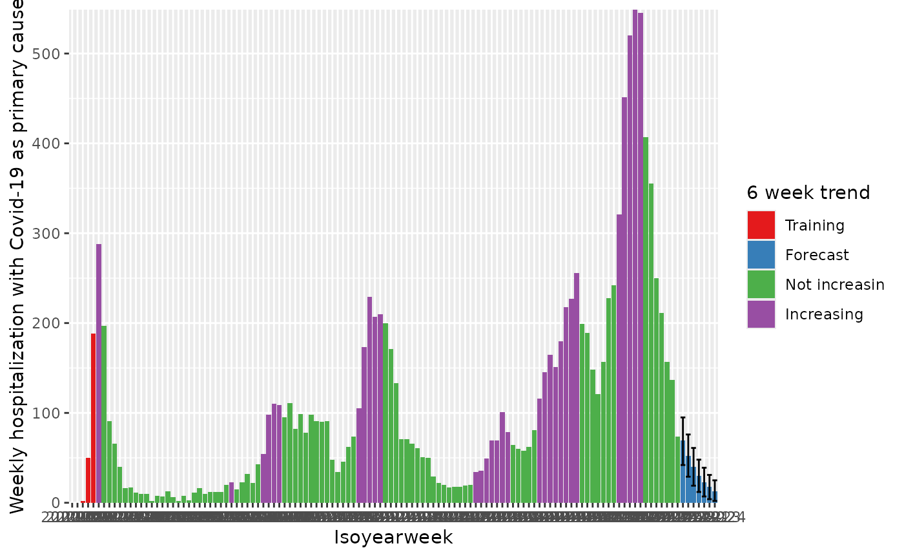
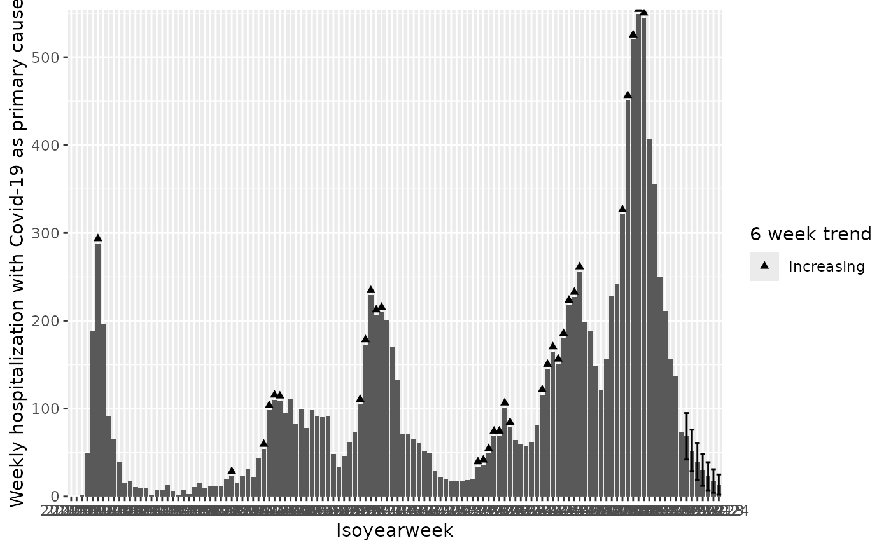
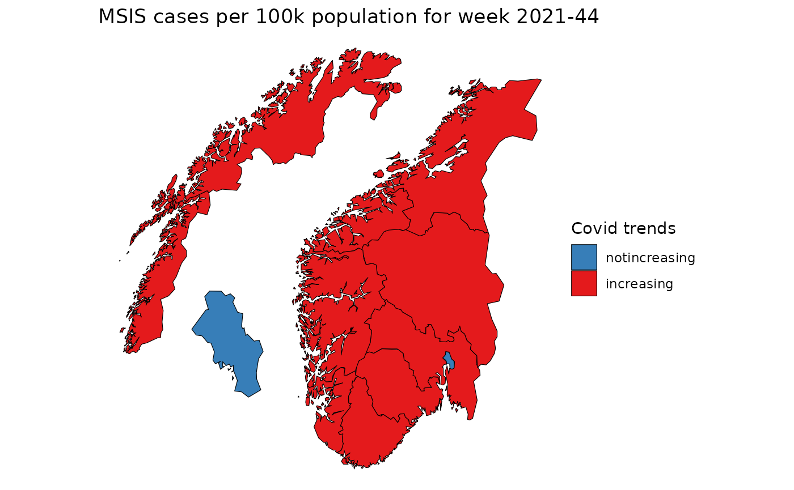

# Short term trend

This vignette shows how to compute short-term trend signals using
[`csalert::short_term_trend`](https://niphr.github.io/csalert/reference/short_term_trend.md).
Two scenarios are covered: a single location (Norway) and multiple
locations (Norwegian counties).

``` r
library(ggplot2)
library(data.table)
#> 
#> Attaching package: 'data.table'
#> The following object is masked from 'package:base':
#> 
#>     %notin%
library(magrittr)
```

## Single location

### Covid-19 hospitalisation data

The dataset contains daily and weekly counts of Covid-19
hospitalisations in Norway where Covid-19 was recorded as the primary
cause. It does not distinguish between age groups or sex.

This extract was pulled on 2022-05-04 and covers 2020-02-21 to
2022-05-03. The raw data in CSV and XLSX formats are available on the
[GitHub
repository](https://github.com/folkehelseinstituttet/surveillance_data).

### Data in `cstidy` format

The data have been pre-processed into [cstidy
format](https://niphr.github.io/cstidy/articles/csfmt_rts_data_v2.html),
which provides a standardised column structure including data types and
missingness information.

``` r
d_hosp <- cstidy::nor_covid19_icu_and_hospitalization_csfmt_rts_v1
d_hosp
#>      granularity_time granularity_geo country_iso3 location_code border    age
#>                <char>          <char>       <char>        <char>  <int> <char>
#>   1:             date          nation          nor    nation_nor   2020  total
#>   2:             date          nation          nor    nation_nor   2020  total
#>   3:             date          nation          nor    nation_nor   2020  total
#>   4:             date          nation          nor    nation_nor   2020  total
#>   5:             date          nation          nor    nation_nor   2020  total
#>  ---                                                                          
#> 915:      isoyearweek          nation          nor    nation_nor   2020  total
#> 916:      isoyearweek          nation          nor    nation_nor   2020  total
#> 917:      isoyearweek          nation          nor    nation_nor   2020  total
#> 918:      isoyearweek          nation          nor    nation_nor   2020  total
#> 919:      isoyearweek          nation          nor    nation_nor   2020  total
#>         sex isoyear isoweek isoyearweek    season seasonweek calyear calmonth
#>      <char>   <int>   <int>      <char>    <char>      <num>   <int>    <int>
#>   1:  total    2020       8     2020-08 2019/2020         31    2020        2
#>   2:  total    2020       8     2020-08 2019/2020         31    2020        2
#>   3:  total    2020       8     2020-08 2019/2020         31    2020        2
#>   4:  total    2020       9     2020-09 2019/2020         32    2020        2
#>   5:  total    2020       9     2020-09 2019/2020         32    2020        2
#>  ---                                                                         
#> 915:  total    2022      14     2022-14      <NA>         NA      NA       NA
#> 916:  total    2022      15     2022-15      <NA>         NA      NA       NA
#> 917:  total    2022      16     2022-16      <NA>         NA      NA       NA
#> 918:  total    2022      17     2022-17      <NA>         NA      NA       NA
#> 919:  total    2022      18     2022-18      <NA>         NA      NA       NA
#>      calyearmonth       date icu_with_positive_pcr_n
#>            <char>     <Date>                   <int>
#>   1:     2020-M02 2020-02-21                       0
#>   2:     2020-M02 2020-02-22                       0
#>   3:     2020-M02 2020-02-23                       0
#>   4:     2020-M02 2020-02-24                       0
#>   5:     2020-M02 2020-02-25                       0
#>  ---                                                
#> 915:         <NA> 2022-04-10                      21
#> 916:         <NA> 2022-04-17                      11
#> 917:         <NA> 2022-04-24                      17
#> 918:         <NA> 2022-05-01                       9
#> 919:         <NA> 2022-05-08                       0
#>      hospitalization_with_covid19_as_primary_cause_n
#>                                                <int>
#>   1:                                               0
#>   2:                                               0
#>   3:                                               0
#>   4:                                               0
#>   5:                                               0
#>  ---                                                
#> 915:                                             211
#> 916:                                             157
#> 917:                                             137
#> 918:                                              74
#> 919:                                              10
```

### Weekly observations

The `short_term_trend` function is run on the weekly subset of the data.
The `trend_isoyearweeks` argument sets the number of weeks used to
estimate the trend, and `remove_last_isoyearweeks` trims the most recent
weeks to account for reporting delays.

``` r
d_hosp_weekly <- d_hosp[granularity_time=="isoyearweek"]

res <- csalert::short_term_trend(
  d_hosp_weekly,
  numerator = "hospitalization_with_covid19_as_primary_cause_n",
  trend_isoyearweeks = 6,
  remove_last_isoyearweeks = 1
)

# create the trend label
res[, hospitalization_with_covid19_as_primary_cause_trend0_41_status := factor(
  hospitalization_with_covid19_as_primary_cause_trend0_41_status,
  levels = c("training","forecast","notincreasing", "increasing"),
  labels = c("Training","Forecast","Not increasin", "Increasing")
)]

colnames(res)
#>  [1] "granularity_time"                                                             
#>  [2] "granularity_geo"                                                              
#>  [3] "country_iso3"                                                                 
#>  [4] "location_code"                                                                
#>  [5] "border"                                                                       
#>  [6] "age"                                                                          
#>  [7] "sex"                                                                          
#>  [8] "isoyear"                                                                      
#>  [9] "isoweek"                                                                      
#> [10] "isoyearweek"                                                                  
#> [11] "season"                                                                       
#> [12] "seasonweek"                                                                   
#> [13] "calyear"                                                                      
#> [14] "calmonth"                                                                     
#> [15] "calyearmonth"                                                                 
#> [16] "date"                                                                         
#> [17] "icu_with_positive_pcr_n"                                                      
#> [18] "hospitalization_with_covid19_as_primary_cause_n"                              
#> [19] "hospitalization_with_covid19_as_primary_cause_forecasted_n"                   
#> [20] "hospitalization_with_covid19_as_primary_cause_forecasted_predinterval_q02x5_n"
#> [21] "hospitalization_with_covid19_as_primary_cause_forecasted_predinterval_q97x5_n"
#> [22] "hospitalization_with_covid19_as_primary_cause_forecasted_n_forecast"          
#> [23] "hospitalization_with_covid19_as_primary_cause_trend0_41_status"               
#> [24] "hospitalization_with_covid19_as_primary_cause_doublingdays0_41"
```

The function adds several new columns to the original data. The example
below shows the forecasted counts alongside the trend status.

``` r
# check some columns
res[
  ,
  .(
    date,
    hospitalization_with_covid19_as_primary_cause_n,
    hospitalization_with_covid19_as_primary_cause_forecasted_n,
    hospitalization_with_covid19_as_primary_cause_trend0_41_status
  )
]
#>            date hospitalization_with_covid19_as_primary_cause_n
#>          <Date>                                           <int>
#>   1: 2020-02-23                                               0
#>   2: 2020-03-01                                               0
#>   3: 2020-03-08                                               2
#>   4: 2020-03-15                                              50
#>   5: 2020-03-22                                             188
#>  ---                                                           
#> 118: 2022-05-22                                              NA
#> 119: 2022-05-29                                              NA
#> 120: 2022-06-05                                              NA
#> 121: 2022-06-12                                              NA
#> 122: 2022-06-19                                              NA
#>      hospitalization_with_covid19_as_primary_cause_forecasted_n
#>                                                           <int>
#>   1:                                                          0
#>   2:                                                          0
#>   3:                                                          2
#>   4:                                                         50
#>   5:                                                        188
#>  ---                                                           
#> 118:                                                         40
#> 119:                                                         30
#> 120:                                                         23
#> 121:                                                         18
#> 122:                                                         13
#>      hospitalization_with_covid19_as_primary_cause_trend0_41_status
#>                                                              <fctr>
#>   1:                                                       Training
#>   2:                                                       Training
#>   3:                                                       Training
#>   4:                                                       Training
#>   5:                                                       Training
#>  ---                                                               
#> 118:                                                       Forecast
#> 119:                                                       Forecast
#> 120:                                                       Forecast
#> 121:                                                       Forecast
#> 122:                                                       Forecast
```

### Visualising trend status

Trend status can be mapped to bar fill colours, with error bars showing
the prediction interval.

``` r
q <- ggplot(
  res,
  aes(
    x = isoyearweek,
    y = hospitalization_with_covid19_as_primary_cause_forecasted_n,
    group = 1
  )
)
q <- q + geom_col(mapping = aes(fill = hospitalization_with_covid19_as_primary_cause_trend0_41_status))
q <- q + geom_errorbar(
  mapping = aes(
    ymin = hospitalization_with_covid19_as_primary_cause_forecasted_predinterval_q02x5_n,
    ymax = hospitalization_with_covid19_as_primary_cause_forecasted_predinterval_q97x5_n
  )
)
q <- q + scale_y_continuous("Weekly hospitalization with Covid-19 as primary cause", expand = c(0, 0.1))
q <- q + scale_x_discrete("Isoyearweek")
q <- q + expand_limits(y=0)
q <- q + scale_fill_brewer("6 week trend", palette = "Set1")
q
```



Point shapes can be used instead, placing a symbol above each bar to
mark the trend category.

``` r
shape_adjustment_factor <- max(res$hospitalization_with_covid19_as_primary_cause_forecasted_n)*0.01
q <- ggplot(
  res,
  aes(
    x = isoyearweek,
    y = hospitalization_with_covid19_as_primary_cause_forecasted_n,
    group = 1
  )
)
q <- q + geom_col()
q <- q + geom_point(mapping = aes(
  y = hospitalization_with_covid19_as_primary_cause_forecasted_n + shape_adjustment_factor,
  shape = hospitalization_with_covid19_as_primary_cause_trend0_41_status
))
q <- q + geom_errorbar(
  mapping = aes(
    ymin = hospitalization_with_covid19_as_primary_cause_forecasted_predinterval_q02x5_n,
    ymax = hospitalization_with_covid19_as_primary_cause_forecasted_predinterval_q97x5_n
  )
)
q <- q + scale_y_continuous("Weekly hospitalization with Covid-19 as primary cause", expand = c(0, 0.1))
q <- q + scale_x_discrete("Isoyearweek")
q <- q + expand_limits(y=0)
q <- q + scale_shape_manual("6 week trend", values = c("Increasing" = 17, "Decreasing" = 6))
q
#> Warning: Removed 91 rows containing missing values or values outside the scale range
#> (`geom_point()`).
```



## Multiple locations

When the data contain multiple locations, `short_term_trend` computes
the trend for each one. Here the function is applied to weekly Covid-19
case counts at county level.

``` r
d <- cstidy::nor_covid19_cases_by_time_location_csfmt_rts_v1[
  granularity_time == "isoyearweek" &
  granularity_geo == "county"
]

trend <- csalert::short_term_trend(
  d,
  numerator = "covid19_cases_testdate_n",
  trend_isoyearweeks = 6,
  remove_last_isoyearweeks = 1
)

print(trend)
#>       granularity_time granularity_geo country_iso3 location_code border    age
#>                 <char>          <char>       <char>        <char>  <int> <char>
#>    1:      isoyearweek          county          nor  county_nor03   2020  total
#>    2:      isoyearweek          county          nor  county_nor03   2020  total
#>    3:      isoyearweek          county          nor  county_nor03   2020  total
#>    4:      isoyearweek          county          nor  county_nor03   2020  total
#>    5:      isoyearweek          county          nor  county_nor03   2020  total
#>   ---                                                                          
#> 1338:      isoyearweek          county          nor  county_nor54   2020  total
#> 1339:      isoyearweek          county          nor  county_nor54   2020  total
#> 1340:      isoyearweek          county          nor  county_nor54   2020  total
#> 1341:      isoyearweek          county          nor  county_nor54   2020  total
#> 1342:      isoyearweek          county          nor  county_nor54   2020  total
#>          sex isoyear isoweek isoyearweek    season seasonweek calyear calmonth
#>       <char>   <int>   <int>      <char>    <char>      <num>   <int>    <int>
#>    1:  total    2020       8     2020-08 2019/2020         31      NA       NA
#>    2:  total    2020       9     2020-09 2019/2020         32      NA       NA
#>    3:  total    2020      10     2020-10 2019/2020         33      NA       NA
#>    4:  total    2020      11     2020-11 2019/2020         34      NA       NA
#>    5:  total    2020      12     2020-12 2019/2020         35      NA       NA
#>   ---                                                                         
#> 1338:  total    2022      20     2022-20 2021/2022         43      NA       NA
#> 1339:  total    2022      21     2022-21 2021/2022         44      NA       NA
#> 1340:  total    2022      22     2022-22 2021/2022         45      NA       NA
#> 1341:  total    2022      23     2022-23 2021/2022         46      NA       NA
#> 1342:  total    2022      24     2022-24 2021/2022         47      NA       NA
#>       calyearmonth       date covid19_cases_testdate_n
#>             <char>     <Date>                    <int>
#>    1:         <NA> 2020-02-23                        0
#>    2:         <NA> 2020-03-01                        7
#>    3:         <NA> 2020-03-08                       39
#>    4:         <NA> 2020-03-15                      276
#>    5:         <NA> 2020-03-22                      366
#>   ---                                                 
#> 1338:         <NA> 2022-05-22                       NA
#> 1339:         <NA> 2022-05-29                       NA
#> 1340:         <NA> 2022-06-05                       NA
#> 1341:         <NA> 2022-06-12                       NA
#> 1342:         <NA> 2022-06-19                       NA
#>       covid19_cases_testdate_pr100000 covid19_cases_testdate_forecasted_n
#>                                 <num>                               <int>
#>    1:                        0.000000                                   0
#>    2:                        1.009381                                   7
#>    3:                        5.623697                                  39
#>    4:                       39.798470                                 276
#>    5:                       52.776232                                 366
#>   ---                                                                    
#> 1338:                              NA                                  12
#> 1339:                              NA                                   7
#> 1340:                              NA                                   4
#> 1341:                              NA                                   3
#> 1342:                              NA                                   2
#>       covid19_cases_testdate_forecasted_predinterval_q02x5_n
#>                                                        <num>
#>    1:                                                     NA
#>    2:                                                     NA
#>    3:                                                     NA
#>    4:                                                     NA
#>    5:                                                     NA
#>   ---                                                       
#> 1338:                                                     -9
#> 1339:                                                     -9
#> 1340:                                                     -8
#> 1341:                                                     -7
#> 1342:                                                     -6
#>       covid19_cases_testdate_forecasted_predinterval_q97x5_n
#>                                                        <num>
#>    1:                                                     NA
#>    2:                                                     NA
#>    3:                                                     NA
#>    4:                                                     NA
#>    5:                                                     NA
#>   ---                                                       
#> 1338:                                                     34
#> 1339:                                                     24
#> 1340:                                                     17
#> 1341:                                                     12
#> 1342:                                                      9
#>       covid19_cases_testdate_forecasted_n_forecast
#>                                             <lgcl>
#>    1:                                        FALSE
#>    2:                                        FALSE
#>    3:                                        FALSE
#>    4:                                        FALSE
#>    5:                                        FALSE
#>   ---                                             
#> 1338:                                         TRUE
#> 1339:                                         TRUE
#> 1340:                                         TRUE
#> 1341:                                         TRUE
#> 1342:                                         TRUE
#>       covid19_cases_testdate_trend0_41_status
#>                                        <fctr>
#>    1:                                training
#>    2:                                training
#>    3:                                training
#>    4:                                training
#>    5:                                training
#>   ---                                        
#> 1338:                                forecast
#> 1339:                                forecast
#> 1340:                                forecast
#> 1341:                                forecast
#> 1342:                                forecast
#>       covid19_cases_testdate_doublingdays0_41
#>                                         <num>
#>    1:                                      NA
#>    2:                                      NA
#>    3:                                      NA
#>    4:                                      NA
#>    5:                                      NA
#>   ---                                        
#> 1338:                                      NA
#> 1339:                                      NA
#> 1340:                                      NA
#> 1341:                                      NA
#> 1342:                                      NA
```

### Mapping trend status

The trend status for a single week can be joined to a county map polygon
dataset and plotted geographically.

``` r
pd <- copy(csmaps::nor_county_map_b2020_split_dt)
pd[
  trend[isoyearweek == "2021-44"],
  on = c("location_code"),
  covid19_cases_testdate_trend0_41_status := covid19_cases_testdate_trend0_41_status
]

# plot map
q <- ggplot()
q <- q + geom_polygon(
  data = pd,
  mapping = aes(x = long, y = lat, group = group,fill=covid19_cases_testdate_trend0_41_status),
  color="black",
  linewidth = 0.2
)
q <- q + coord_quickmap()
q <- q + theme_void()
q <- q + labs(title="MSIS cases per 100k population for week 2021-44")
q <- q + scale_fill_brewer("Covid trends", palette = "Set1", direction = -1)
q
```


